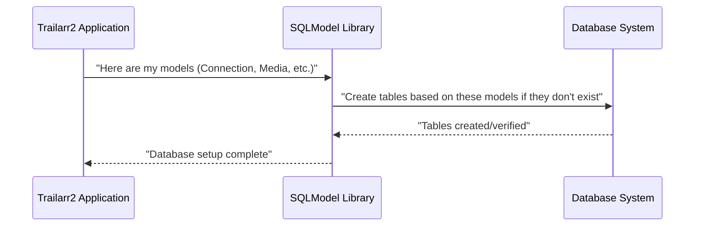

# Chapter 1: Database Models

Welcome to the first chapter of the Trailarr2 tutorial!

Think of Trailarr2 as an organized library for your movie and series trailers. Just like a real library needs shelves, labels, and a catalog system to keep track of everything, a software application like Trailarr2 needs a way to organize the information it uses. This is where a database comes in.

A **database** is like a super-organized digital filing cabinet where applications store their information so they can find and use it later.

But how does Trailarr2 know *what* information to store and *how* to arrange it in that filing cabinet? That's the job of **Database Models**.

## What are Database Models? The Blueprint Analogy

Imagine you're building a house. Before you start, you need blueprints. These blueprints show exactly what the house will look like, how many rooms it has, where the doors and windows go, and what materials to use.

In Trailarr2, database models are the **blueprints** for the data it stores. They define the structure and rules for the information, like:

*   What details do we need to keep about a movie or series? (e.g., title, year, trailer link)
*   What information is required to connect to a media server like Radarr or Sonarr? (e.g., name, web address, API key)
*   How do we store the settings for *how* to download trailers? (e.g., video quality, file name format)

These models ensure that whenever Trailarr2 saves information, it's saved consistently and correctly.

## Our Guiding Example: Defining a Connection

Let's look at a concrete example. Trailarr2 needs to connect to your media servers (like Radarr or Sonarr) to find out about your movies and series. How does Trailarr2 know what information to ask for and store for each connection?

The answer lies in the database model designed specifically for this: the `Connection` model.

## Breaking Down the `Connection` Model Blueprint

Trailarr2 uses a Python library called `SQLModel` to define its database blueprints. SQLModel helps us define models that can automatically create database tables and make it easy to save and load data.

Let's look at a simplified version of the `Connection` model from the `connection.py` file:

```python
# From: backend/core/base/database/models/connection.py

from sqlmodel import Field, Relationship, SQLModel
from enum import Enum

class ArrType(Enum):
    RADARR = "radarr"
    SONARR = "sonarr"

class Connection(SQLModel, table=True):
    id: int | None = Field(default=None, primary_key=True)
    name: str
    arr_type: ArrType # Tells us if it's Radarr or Sonarr
    url: str # The web address
    api_key: str # The secret key to connect
    # added_at: datetime ... (other fields omitted for simplicity)

    # A connection can have multiple path mappings
    # path_mappings: list[PathMapping] = Relationship()
```

Okay, let's break down what this blueprint tells us:

1.  **`class Connection(SQLModel, table=True):`**: This line declares our blueprint named `Connection`.
    *   `SQLModel`: Tells Python this class is special and will be used by `SQLModel`.
    *   `table=True`: **This is important!** It tells SQLModel that this blueprint corresponds to a real table in the database. SQLModel will create a table named `connection` (by default, lowercase class name) when Trailarr2 starts up if it doesn't exist.

2.  **`id: int | None = Field(default=None, primary_key=True)`**: This defines a specific piece of information, an `id`.
    *   `id`: The name of this piece of data (like a column name in a spreadsheet).
    *   `int | None`: The type of data expected. It's an integer (`int`) and can sometimes be empty (`None`).
    *   `Field(...)`: This tells SQLModel more about this piece of data.
    *   `default=None`: When we create a *new* Connection blueprint, we don't need to provide an ID; the database will give it one automatically.
    *   `primary_key=True`: This marks the `id` as the unique identifier for each row in the `connection` table. Like a unique house number on a street!

3.  **`name: str`**: Defines a `name` field that must be a string of text (`str`). This is for you to give the connection a friendly name (like "My Radarr Server").

4.  **`arr_type: ArrType`**: Defines `arr_type`. Look at the `ArrType(Enum)` class above. `Enum` means it can *only* be one of a few predefined values, like "radarr" or "sonarr". This ensures we only store valid types for connections.

5.  **`url: str`**: The web address (URL) of your media server, stored as a string.

6.  **`api_key: str`**: The secret key needed to talk to your media server, also stored as a string.

7.  **`path_mappings: list[PathMapping] = Relationship()`**: (Commented out in the simplified example, but present in the full code). This indicates that a `Connection` blueprint is related to one or more `PathMapping` blueprints. A `Relationship` is how SQLModel links data between different tables (like a Connection having multiple associated Path Mapping settings). We'll see more about [Database Managers](04_database_managers_.md) later, which handle saving and loading these relationships.

This `Connection` model blueprint tells Trailarr2 exactly what information is needed to define a connection to a media server and how that information should be structured in the database.

## Why Multiple Model Versions? (Base, Create, Read)

You might have noticed in the code snippets that there are often several models for the same concept, like `ConnectionBase`, `Connection`, `ConnectionCreate`, and `ConnectionRead`. Why?

This is a common practice to make the application safer and easier to understand.

*   **`ConnectionBase`**: Contains the common fields shared by different versions. It's a base template that others build upon.
*   **`Connection(..., table=True)`**: This is the model that directly maps to the database *table*. You typically use this when you are interacting directly with the database itself (saving, loading).
*   **`ConnectionCreate`**: This blueprint is used when you are **creating** a *new* connection. It specifies the minimum information needed from the user (like name, url, api_key, and path mappings). It often doesn't include fields like `id` or `added_at` because those are generated by the database.
*   **`ConnectionRead`**: This blueprint is used when you are **reading** or *displaying* connection information. It includes all the data, including the `id` and `added_at` timestamp generated by the database.
*   **`ConnectionUpdate`**: Used when you are **changing** an existing connection. It includes fields that you are allowed to modify.

Using these different versions helps ensure that when you're creating a connection (e.g., via the user interface or API), you're only sending the necessary data, and when you're viewing one, you see all the relevant information.

## Other Blueprints in Trailarr2

Besides `Connection` and `PathMapping`, Trailarr2 has other important models defining different types of data:

*   **`Media`**: The blueprint for individual movies or series that Trailarr2 knows about. It includes fields like `title`, `year`, ``youtube_trailer_id`, `folder_path`, and statuses like `monitor` and `trailer_exists`.
*   **`TrailerProfile`**: The blueprint for *how* trailers should be downloaded and named. It holds settings like `file_format`, `video_resolution`, `file_name` template, and duration limits.
*   **`CustomFilter`** and **`Filter`**: These blueprints work together to define rules for filtering media items. A `CustomFilter` can have multiple `Filter` rules (e.g., "Genre is Action" AND "Year is after 2020"). These filters are used by `TrailerProfile`s to decide which media items should get trailers downloaded with those specific settings.

Each of these models is a blueprint defining the structure of a specific type of information Trailarr2 needs to store and manage.

## How Database Models Work Under the Hood (Simple View)

When Trailarr2 starts for the very first time, it looks at all the `SQLModel` classes marked with `table=True`. It then communicates with the database system (like SQLite, which is often used for simple local databases) and says: "Okay, create tables named `connection`, `media`, `trailerprofile`, `customfilter`, and `filter`, using these blueprints I've given you."



Later, when you add a new connection through the Trailarr2 interface, the application creates a `ConnectionCreate` object with the details you entered. Then, a part of the application responsible for database interaction (we'll learn about [Database Managers](04_database_managers_.md) in a later chapter) uses the `Connection` model blueprint to figure out how to save this new connection as a new row in the `connection` table in the database.

## Summary and What's Next

In this chapter, we learned that Database Models are the essential blueprints defining the structure of the data Trailarr2 stores. They act like templates for tables in the database, ensuring data consistency. We saw how the `Connection` model defines the structure for storing media server connection details and briefly looked at other models like `Media` and `TrailerProfile`.

Understanding these blueprints is the first step to understanding how Trailarr2 organizes its information.

Now that we know how the data is structured, the next chapter will look at how the application uses and manages important pieces of this data, focusing on settings.

Ready to learn more about how Trailarr2 keeps track of your preferences and configurations? Let's move on!

[Chapter 2: Application Settings](02_application_settings_.md)

---

Generated by [AI Codebase Knowledge Builder](https://github.com/The-Pocket/Tutorial-Codebase-Knowledge)