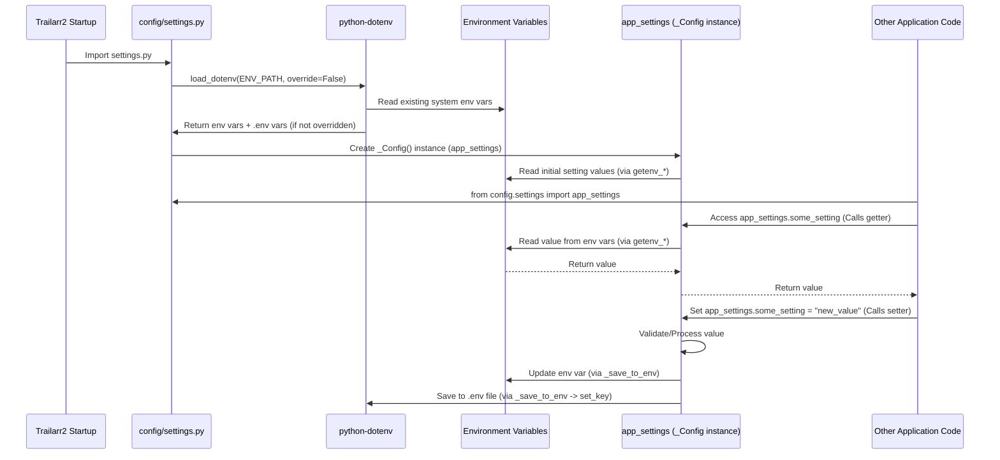

# Chapter 2: Application Settings

Welcome back to the Trailarr2 tutorial! In [Chapter 1: Database Models](01_database_models_.md), we learned about the blueprints that define *what kind* of data Trailarr2 stores – things like information about your media servers or the movies/series themselves.

But knowing *what* data to store isn't enough. Trailarr2 also needs to know *how* to behave. Should it download trailers in high definition or standard definition? Where should it save the files? How often should it check your media servers for new items? This is where **Application Settings** come in.

## What are Application Settings? The Control Panel

Imagine Trailarr2 is a complex machine. Application settings are like the **control panel** for that machine. They contain all the knobs, switches, and configurations that tell the application *how* to run and *what* its preferences are.

These settings aren't stored in the database (that's for dynamic data like your list of movies or connections). Settings are typically static values that determine the overall behavior of the app itself.

Why do we need a central place for settings?
*   **Flexibility:** You can change how the app works without changing the actual code.
*   **Customization:** You can tailor Trailarr2 to your specific setup and preferences (like preferred trailer quality).
*   **Environment Specificity:** Settings can easily change depending on where Trailarr2 is running (e.g., in a Docker container vs. on your local machine).

## Our Guiding Example: Setting Trailer Resolution

Let's take a simple example: deciding the **video resolution** for downloaded trailers. You might prefer 1080p (Full HD) for crisp quality, or maybe 720p (HD) to save space. This is a perfect candidate for an application setting.

Trailarr2 needs a way to:
1.  Know what your preferred resolution is when it starts up.
2.  Let other parts of the application (like the one that downloads trailers) easily access this preference.
3.  Potentially allow you to change this preference later.

## Where Do Settings Come From? Environment Variables & .env File

Trailarr2, like many modern applications, gets its settings primarily from **environment variables**. These are special variables set outside the application code, often in the operating system or the container environment (like Docker).

Trailarr2 also uses a file called `.env` (short for "environment") in its data directory (`/config` by default). This file acts as a simple list of `KEY=VALUE` pairs, like:

```
TRAILER_RESOLUTION=1080
LOG_LEVEL=INFO
API_KEY=some_secret_key
```

When Trailarr2 starts, it first reads this `.env` file. Then, it looks at the system's environment variables. **System environment variables override** settings found in the `.env` file. This provides flexibility: you can set common defaults in `.env` but easily change a specific setting for a running instance using a system environment variable.

## Accessing Settings with `app_settings`

Inside the Trailarr2 code, all these settings are gathered into a single, easy-to-access object. This object is typically named `app_settings`.

Any part of the application that needs to know a setting (like the preferred trailer resolution) just needs to import `app_settings` and access the relevant property.

Let's see how you might get the trailer resolution setting in some hypothetical part of the code:

```python
# Imagine this is in a file responsible for downloads

from config.settings import app_settings # Import the settings object

def download_trailer(media_item):
    # Get the desired resolution from the settings
    desired_resolution = app_settings.trailer_resolution

    print(f"Downloading trailer for {media_item.title} at {desired_resolution}p")
    # ... rest of the download logic ...

# Example usage (not actual running code here)
# download_trailer(some_movie_object)
# Output might be: Downloading trailer for Inception at 1080p
```

This makes accessing settings very clean and centralized. Instead of having to read environment variables directly everywhere, you just use the `app_settings` object.

## How Trailarr2 Loads and Manages Settings Internally

Let's peek behind the curtain to see how Trailarr2 achieves this. The core logic for settings lives in the `backend/config/settings.py` file.

Here's a simplified step-by-step look:

1.  **Load `.env`:** When the `settings.py` file is processed (which happens early in the application startup), the `load_dotenv()` function is called. This function looks for the `.env` file and reads its contents, adding them to the environment variables *if* a variable with the same name doesn't already exist in the system's environment.

    ```python
    # From backend/config/settings.py
    from dotenv import load_dotenv # Import the loader

    # ... define APP_DATA_DIR and ENV_PATH ...

    # Load environment variables from .env file
    # System environment variables take precedence
    load_dotenv(dotenv_path=ENV_PATH, override=False)
    ```
    This ensures that variables from the `.env` file are available alongside any system environment variables.

2.  **Define the Configuration Blueprint (`_Config` class):** A Python class named `_Config` is defined. This class acts as the blueprint for our settings object. It doesn't hold the *values* directly as standard class attributes; instead, it uses special **properties** that know how to read from and write to environment variables.

    ```python
    # From backend/config/settings.py

    # Helper functions to get values from environment variables
    def getenv_str(key: str, default: str) -> str:
        return os.getenv(key.upper(), default)

    # Special helper function to create properties
    def str_property(name: str, *, default: str, valid_values: list[str] = []) -> property:
        def getter(self) -> str:
            # When you access settings.SOME_SETTING, this runs
            return getenv_str(name, default)

        def setter(self, value: str) -> None:
            # When you set settings.SOME_SETTING = "new_value", this runs
            # It saves the value to the environment and .env file
            _save_to_env(name, value)

        return property(getter, setter)


    class _Config:
        _DEFAULT_RESOLUTION = 1080
        # ... other defaults and valid values ...

        # Define the trailer_resolution property using the helper
        @property # This decorator is another way to define a property
        def trailer_resolution(self) -> int:
            # The getter for resolution needs custom logic
            return self._trailer_resolution # Reads an internal variable

        @trailer_resolution.setter
        def trailer_resolution(self, value: str | int):
             # The setter has custom validation/resolution logic
             self._trailer_resolution = self.resolve_closest_resolution(value)
             self._save_to_env("TRAILER_RESOLUTION", self._trailer_resolution)


        # Define other properties using the helper functions
        log_level = str_property("LOG_LEVEL", default="INFO", valid_values=["DEBUG", "INFO", "WARNING", "ERROR", "CRITICAL"])
        api_key = str_property("API_KEY", default="") # This one has custom setter later

        # ... many other settings defined similarly ...

        def __init__(self):
            # When the _Config object is created, it reads initial values
            # for settings that need immediate processing or validation
            # (like calling resolve_closest_resolution for trailer_resolution)
            self.trailer_resolution = getenv_str("TRAILER_RESOLUTION", str(self._DEFAULT_RESOLUTION))
            self.log_level = getenv_str("LOG_LEVEL", "INFO") # Initial read for validation
            self.api_key = getenv_str("API_KEY", "") # Initial read for validation
            # ... initialize other settings via their setters for validation ...


        def _save_to_env(self, key: str, value: str | int | bool):
             # Helper to save key=value to environment and .env
             os.environ[key.upper()] = str(value)
             set_key(ENV_PATH, key.upper(), str(value))

        def resolve_closest_resolution(self, value: str | int) -> int:
             # Logic to find the nearest valid resolution
             pass # Simplified for example
    ```
    Notice how accessing `settings.log_level` actually runs the `getter` function associated with the `log_level` property, which in turn reads the value from the environment variables using `getenv_str`. Similarly, setting `settings.log_level = "DEBUG"` runs the `setter`, which calls `_save_to_env` to update both the current environment and the `.env` file. Some settings, like `trailer_resolution` and `api_key`, have more complex getters/setters defined using the `@property` decorator for custom validation or generation logic.

3.  **Create the Single Instance (`app_settings`):** Finally, a single instance of the `_Config` class is created and assigned to the variable `app_settings`. This uses a pattern called the **Singleton pattern**, which ensures that only one `_Config` object ever exists throughout the application's lifetime.

    ```python
    # From backend/config/settings.py

    # Create Config object to be used in the application
    # This line runs once when settings.py is imported
    app_settings = _Config()
    ```
    Now, any part of the application can `from config.settings import app_settings` and be sure they are accessing the *same* control panel instance with all the loaded and managed settings.

Here's a simplified flow of how settings are accessed:



This setup provides a robust and flexible way to manage application configuration, reading from external sources (environment variables, `.env`) and making them easily accessible and modifiable within the application via the central `app_settings` object.

The tests in `backend/tests/config/test_config.py` (provided in the code snippets) show examples of how the property setters handle invalid input, falling back to default values or valid options, demonstrating the validation logic built into the `_Config` class properties.

## Summary and What's Next

In this chapter, we explored the concept of Application Settings, understanding them as the control panel for Trailarr2's behavior. We learned that settings are loaded from environment variables and a `.env` file, with environment variables taking precedence. We saw how the `app_settings` object provides a centralized way to access these settings throughout the application code and got a peek into the internal mechanism using properties to read and write settings, linking them back to the environment variables and the `.env` file.

Now that we understand how Trailarr2 stores its data structure ([Database Models](01_database_models_.md)) and how it manages its configuration and preferences (Application Settings), we are ready to look at the very beginning of the application's execution.

Let's move on to see where the Trailarr2 application actually starts running.

[Chapter 3: Main Application Entry](03_main_application_entry_.md)

---

Generated by [AI Codebase Knowledge Builder](https://github.com/The-Pocket/Tutorial-Codebase-Knowledge)