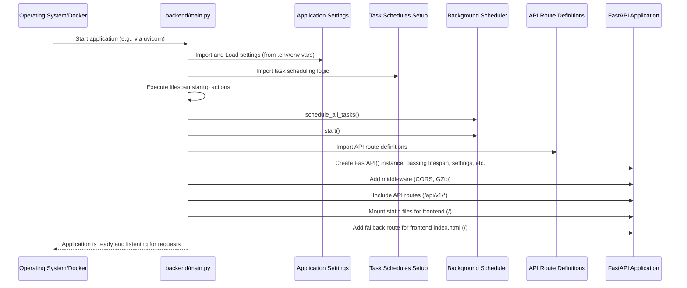

# Chapter 3: Main Application Entry

Welcome back to the Trailarr2 tutorial!

In [Chapter 1: Database Models](01_database_models_.md), we learned about the blueprints that define the *structure* of the data Trailarr2 uses (like what information makes up a "Connection"). In [Chapter 2: Application Settings](02_application_settings_.md), we explored the control panel that lets us configure *how* Trailarr2 behaves (like preferred trailer resolution).

But how do all these pieces — the data structures, the settings, and all the other logic we haven't even discussed yet — get put together and started? How does the application actually *run*?

This is the job of the **Main Application Entry** point.

## What is the Main Application Entry? The Central Hub

Imagine Trailarr2 is like a complex office with different departments: a department for managing movie data, one for downloading files, one for scheduling tasks, and a reception area that handles incoming requests (like from your web browser).

The Main Application Entry point is like the **central switchboard operator** or the **office manager** who arrives first thing in the morning. Their job is to:

1.  Unlock the building (Start the web server).
2.  Turn on the lights and computers (Set up logging and load settings).
3.  Make sure all the departments are ready for work (Initialize database, prepare task scheduler).
4.  Connect the reception area to the right departments so incoming calls (web requests) go to the right place (Register API routes, serve the frontend).
5.  Ensure everything is shut down properly at the end of the day.

It's the starting point that orchestrates the entire application. For Trailarr2, this central hub is primarily managed in the `backend/main.py` file.

## Our Guiding Example: Starting the Web Server

The most visible part of Trailarr2 is its web interface. When you open `http://localhost:7889` in your browser, you are interacting with the web server that the Main Application Entry point starts.

The core task of the main entry point is to set up this web server using a powerful tool called **FastAPI**.

## Understanding the Key Pieces

Let's look at the `backend/main.py` file to see how the central hub does its job.

First, it needs to import all the different components it will connect:

```python
# From: backend/main.py (Simplified Imports)
import os
from fastapi import FastAPI, WebSocket, WebSocketDisconnect
from fastapi.middleware.cors import CORSMiddleware
from fastapi.staticfiles import StaticFiles # To serve frontend files

from app_logger import ModuleLogger # Our custom logger
from api.v1.routes import api_v1_router # The rules for handling API requests
from api.v1.websockets import ws_manager # For real-time updates
from config.settings import app_settings # Our application settings
from core.tasks import scheduler # The background task scheduler
from core.tasks.schedules import schedule_all_tasks # The list of tasks to schedule

# Setup logger for this file
logging = ModuleLogger("Main")

# ... rest of the code ...
```

This part is like gathering all the necessary staff and tools before opening the office doors. We import FastAPI, our logger, the settings object we learned about, the scheduler, the definitions of our API routes, and more.

## Startup and Shutdown Tasks (`lifespan`)

Some things need to happen *before* the web server is fully ready to accept requests, and some things need to happen right *before* the application shuts down. FastAPI provides a special way to handle this called `lifespan`.

Trailarr2 uses `lifespan` to manage its background task scheduler:

```python
# From: backend/main.py
from contextlib import asynccontextmanager
# ... other imports ...

@asynccontextmanager
async def lifespan(app: FastAPI):
    # --- Actions to do BEFORE the application starts ---
    # Schedule all tasks that need to run regularly
    logging.debug("Scheduling tasks")
    schedule_all_tasks()
    # Start the scheduler (like clocking in the task department)
    scheduler.start()

    # --- The application is now running ---
    # The 'yield' statement tells FastAPI to run the application now
    yield

    # --- Actions to do BEFORE the application shuts down ---
    # Shut down the scheduler (like clocking out the task department)
    logging.debug("Shutting down scheduler")
    scheduler.shutdown()

# ... rest of the code ...
```

This function is crucial. It ensures that our background tasks (like checking for new media or downloading trailers) start running *after* the application is set up but *before* it starts handling web requests. It also makes sure the scheduler is stopped cleanly when Trailarr2 is closed.

## Creating the FastAPI Application Object

This is the core step where the main web server instance is created. It's like giving the main switchboard operator their desk and phone system:

```python
# From: backend/main.py (Simplified)
# ... imports and lifespan function ...

# Create the FastAPI application instance
logging.info("Starting Trailarr application")
logging.debug("Creating the FastAPI application")
trailarr_api = FastAPI(
    lifespan=lifespan, # Connect our startup/shutdown logic
    title="Trailarr API", # Title for documentation
    version="0.0.1", # Version number
    root_path=f"{app_settings.url_base}", # Base URL path from settings
    openapi_url="/api/v1/openapi.json", # Where to find the API spec
    # ... other configuration details like docs URLs, contact info, license ...
)

# ... rest of the code ...
```

The `FastAPI(...)` line creates the central web application object, typically named `app` or `trailarr_api` in this case. We pass our `lifespan` function to it so FastAPI knows what to do during startup and shutdown. We also configure basic information like the title and version, which are used, for instance, to generate the API documentation (which we'll touch upon in [Frontend API Services (Generated)](09_frontend_api_services__generated__.md)). The `root_path` is important because it tells FastAPI where the application is expected to be accessed from, using a value read from our [Application Settings](02_application_settings_.md).

## Adding Middleware

Middleware is like a set of services that are applied to almost *every* incoming request before it reaches the specific code that handles it, and also to the outgoing response. Think of it as a security checkpoint or a universal translator for all communications.

Trailarr2 adds middleware for things like handling Cross-Origin Resource Sharing (CORS) and GZip compression:

```python
# From: backend/main.py (Simplified)
# ... FastAPI app creation ...

# Add middleware - these process requests before they reach the route handler
# and responses before they are sent back.
trailarr_api.add_middleware(
    CORSMiddleware, # Allows web pages from other domains to talk to the API
    allow_origins=["*"], # '*' means allow requests from ANY origin (use with caution!)
    allow_credentials=True,
    allow_methods=["*"],
    allow_headers=["*"],
)

trailarr_api.add_middleware(GZipMiddleware, minimum_size=1000) # Compresses responses

# ... rest of the code ...
```

This tells FastAPI to wrap every incoming request and outgoing response with these extra steps, ensuring compatibility and efficiency.

## Registering API Routes

Now, the switchboard operator needs to know which department handles which type of call. In a web application, this means connecting specific URL paths (like `/api/v1/connections`) to the Python code that should run when a request comes to that path.

Trailarr2 registers its API routes using `include_router`:

```python
# From: backend/main.py (Simplified)
# ... middleware setup ...

# Health check route - a simple check to see if the app is running
@trailarr_api.get("/status", tags=["Health Check"])
async def health_check():
    return {"status": "healthy"}

# Register API routes - connects paths like /api/v1/connections to the code
# that handles connection requests.
trailarr_api.include_router(api_v1_router, prefix="/api/v1")

# ... rest of the code ...
```

The `@trailarr_api.get("/status", ...)` line defines a simple route. The `trailarr_api.include_router(api_v1_router, prefix="/api/v1")` line is more significant. It takes a collection of routes defined elsewhere (in `api_v1_router`, which comes from `backend/api/v1/routes.py` as seen in the snippets) and adds them to our main application under the `/api/v1` path. This means a request to `/api/v1/connections` will be handled by the code defined in the `api_v1_router`. We will explore what code handles these requests in chapters like [Frontend API Services (Generated)](09_frontend_api_services__generated__.md).

## Serving the Frontend

Finally, the main entry point is also responsible for serving the actual user interface files (HTML, CSS, JavaScript) that your web browser loads. These are typically static files that don't require dynamic processing by our Python code for every request.

Trailarr2 uses FastAPI's `StaticFiles` feature for this:

```python
# From: backend/main.py (Simplified)
# ... include API router ...

# Directory where the frontend files are built
static_dir = os.path.abspath("/app/frontend-build/browser")

# Mount the static directory to serve files.
# The '/' means this catches requests that didn't match any API routes above.
trailarr_api.mount("/", StaticFiles(directory=static_dir), name="frontend")

# Special route to handle serving index.html for app routes, while also
# serving other static files. This needs careful handling because the frontend
# uses client-side routing.
@trailarr_api.get("/{rest_of_path:path}", include_in_schema=False)
async def serve_frontend(rest_of_path: str = ""):
    # Logic to check if the path is a static file or should serve index.html
    # ... simplified for example ...
    file_path = os.path.normpath(os.path.join(static_dir, rest_of_path))
    if os.path.isfile(file_path):
        return FileResponse(file_path) # Serve the specific file (like a CSS or JS file)
    else:
        # Serve index.html for all other paths (this is for frontend routing)
        headers = {"Set-Cookie": f"trailarr_api_key={app_settings.api_key}; SameSite=Strict; Path=/"}
        return HTMLResponse(content=open(f"{static_dir}/index.html").read(), headers=headers)

# ... This part comes BEFORE the mount('/') call usually in the code,
# because specific path handlers take precedence over mounted directories.
# The logic in the code snippet correctly places the get("/") handler AFTER
# the mount, but due to how FastAPI routing works, the explicit GET handlers
# often need to be defined logically first or handle the fallback explicitly.
# The provided snippet's order works because the get("/") path parameter
# `{rest_of_path:path}` is less specific than the mounted files within /.
# Let's simplify the explanation to just the mount and the handler for clarity.
```

This code does a few things:
1.  It defines `static_dir`, pointing to where the built frontend files are located (like the reception area).
2.  `trailarr_api.mount("/", StaticFiles(directory=static_dir), name="frontend")` tells FastAPI to look in this directory for files if an incoming request's path doesn't match any of the API routes defined earlier. If you request `/styles.css`, FastAPI will look for `styles.css` inside `static_dir`.
3.  The `@trailarr_api.get("/{rest_of_path:path}", ...)` route is the fallback. If the path doesn't match a static file *within* the mounted directory (or any other API route), this route handles it. For frontend applications, this typically means serving the main `index.html` file, allowing the frontend's JavaScript ([Frontend UI Components](10_frontend_ui_components_.md)) to then figure out which page to display based on the URL path (this is called client-side routing). It also adds the API key as a cookie, which is needed for the frontend to authenticate with the API.

This setup ensures that requests for API data go to the Python backend logic, while requests for user interface files load the interface in your browser.

## How it All Starts (Simplified Flow)

Putting it all together, here's a basic sequence of what happens when Trailarr2 starts:



The `main.py` file is the conductor, importing and initializing the necessary parts ([Application Settings](02_application_settings_.md), [Task Scheduling](08_task_scheduling_.md), API routes, etc.) and assembling them into a working FastAPI application that's ready to handle incoming requests and run background tasks.

## Summary and What's Next

In this chapter, we looked at the **Main Application Entry**, primarily focusing on the `backend/main.py` file. We learned that it's the central point responsible for starting the application, setting up the web server using FastAPI, handling startup/shutdown tasks via `lifespan`, adding middleware for common services, registering API routes, and serving the frontend user interface files. It acts as the orchestrator that connects all the different components of the Trailarr2 backend.

Now that we know how the application starts and handles incoming requests, let's dive deeper into how it actually interacts with the information stored in the database.

Let's move on to learn about [Database Managers](04_database_managers_.md).

[Chapter 4: Database Managers](04_database_managers_.md)

---

Generated by [AI Codebase Knowledge Builder](https://github.com/The-Pocket/Tutorial-Codebase-Knowledge)