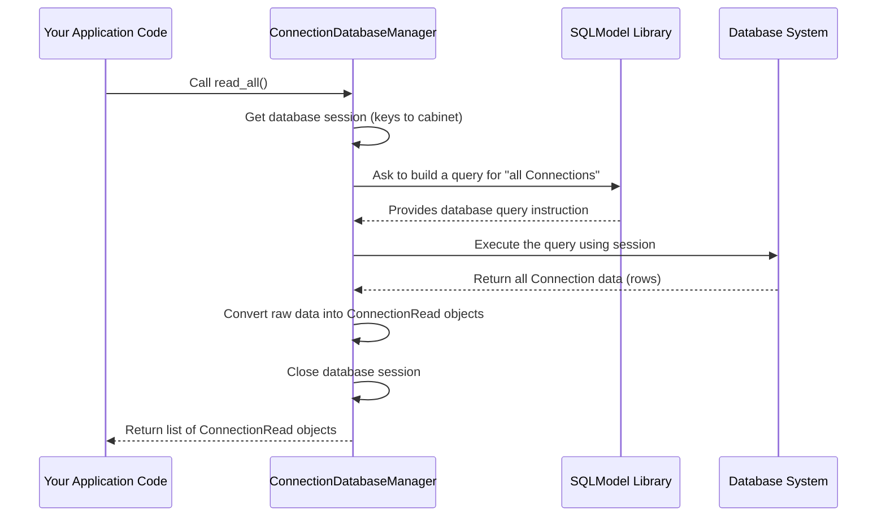

# Chapter 4: Database Managers

Welcome back to the Trailarr2 tutorial!

In [Chapter 1: Database Models](01_database_models_.md), we learned about the blueprints (like `Connection` or `Media`) that define the structure of our data in the database. In [Chapter 2: Application Settings](02_application_settings_.md), we saw how Trailarr2 manages its configuration and preferences. And in [Chapter 3: Main Application Entry](03_main_application_entry_.md), we explored how the application starts up and gets ready to handle requests.

Now that we know *what* data looks like (models) and *how* the application starts, the next question is: **How does the application actually *use* those blueprints to talk to the database?** How does it save a new connection you add, find a specific movie, or update a setting?

This is where **Database Managers** come into play.

## What are Database Managers? The Librarians

Imagine your database (from Chapter 1) is a huge, organized library with many filing cabinets (the tables defined by models). You, as the application user, want to interact with this library – maybe add a new book (create a new media item), find a specific book (read a media item), update details about a book (update a media item), or remove a book (delete a media item).

You wouldn't go rummaging through the filing cabinets yourself. You'd go to a specialized librarian!

**Database Managers** are like the **librarians** for Trailarr2's database. They are specific objects in the code whose job is to provide **standard tools and instructions** for interacting with a particular type of data in the database.

Think of it this way:
*   You want to find all "Connection" items? Ask the "Connection Librarian".
*   You want to add a new "Media" item? Ask the "Media Librarian".
*   You want to update a "Trailer Profile"? Ask the "Trailer Profile Librarian".

Each manager is specialized for the type of data (model) it handles. This keeps the code organized and ensures that all database interactions for a specific model go through a single, controlled point.

## Our Guiding Example: Listing All Connections

A very common task in Trailarr2 is showing you the list of media server connections you've added. How does the application get this list from the database? It asks the **Connection Database Manager**.

The Connection Database Manager has a specific method (an instruction) for this task, something like `read_all()`.

## Using a Database Manager (The Simple Way)

In many parts of the Trailarr2 code that need to interact with connections, you'll see something like this:

```python
# Imagine this is in a file handling API requests for connections

from core.base.database.manager.connection import ConnectionDatabaseManager

# Create an instance of the manager for Connections
connection_manager = ConnectionDatabaseManager()

# Ask the manager to get all connections
all_connections = connection_manager.read_all()

# Now you have a list of all connections from the database!
# print(f"Found {len(all_connections)} connections.")
```

Let's break this simple example down:

1.  **`from core.base.database.manager.connection import ConnectionDatabaseManager`**: This line imports the specific librarian (the manager class) responsible for `Connection` data.
2.  **`connection_manager = ConnectionDatabaseManager()`**: This creates an instance of that librarian. Now you have someone ready to take your requests.
3.  **`all_connections = connection_manager.read_all()`**: This is you asking the librarian (`connection_manager`) to perform the "read all" task. The `read_all()` method contains all the specific database instructions needed to fetch every `Connection` item and return it as a list.

That's it from the perspective of *using* the manager! You don't need to know *how* it talks to the database; you just call the right method (instruction) on the right manager.

## How Database Managers Work Under the Hood (The Librarian's Process)

So, what happens when you call `connection_manager.read_all()`? This is where the manager acts like a skilled librarian who knows the database's catalog system (SQLModel) and how to access the filing cabinets (the database connection).

Here's a simplified look at the process:



This sequence shows that the manager is doing several important things behind the scenes:

1.  **Getting a Database Session:** It needs to establish a connection or get permission to talk to the database. This is like getting the keys or authorization to access the filing cabinets.
2.  **Building the Query:** It uses the SQLModel library (from Chapter 1) and the `Connection` blueprint to figure out the exact database command needed to select all records from the `connection` table.
3.  **Executing the Query:** It sends that command to the actual database system.
4.  **Processing the Results:** It receives the data back from the database (which might be in a raw format) and converts it into the structured `ConnectionRead` objects we learned about in Chapter 1. These are the easy-to-use objects your application code expects.
5.  **Managing the Session:** Crucially, it properly closes the database connection or releases the session when it's done. This is important for application performance and stability.

This whole process is hidden from the code that *uses* the manager, making it much cleaner and less error-prone.

## Peeking Inside a Database Manager

Let's look at a simplified version of the `read_all` method within the `ConnectionDatabaseManager` class (found in `backend/core/base/database/manager/connection.py`):

```python
# From: backend/core/base/database/manager/connection.py (Simplified)

from sqlmodel import Session, select
from core.base.database.models.connection import Connection, ConnectionRead
# ... other imports ...
from core.base.database.utils.engine import manage_session # Import a helpful tool

class ConnectionDatabaseManager:
    """CRUD operations for the Connection database table"""

    @manage_session # This helps handle the database session automatically!
    def read_all(
        self,
        *, # This means _session must be passed by name, not position
        _session: Session = None,  # type: ignore # The automatic session
    ) -> list[ConnectionRead]:
        """Read all connections from the database \n
        ... documentation omitted for brevity ...
        """
        # 1. Define the query: Select all records from the 'Connection' model
        statement = select(Connection)

        # 2. Execute the query using the provided database session
        connections = _session.exec(statement).all()

        # 3. Convert the results (database objects) to read-only models
        return [ConnectionRead.model_validate(connection) for connection in connections]

    # ... other manager methods like create, update, delete, read ...
```

Walking through this simplified code:

1.  **`@manage_session`**: This is a special helper (a "decorator" in Python) that wraps the `read_all` method. Its job is to automatically get a database `_session` ready *before* the method runs and ensure it's properly closed *after* the method finishes or if an error occurs. You don't see the complex session handling code here because the decorator takes care of it!
2.  **`_session: Session = None, # type: ignore`**: This indicates that the `read_all` method expects a database `_session`. Because of the `@manage_session` decorator, we don't need to provide it when *calling* `read_all`; the decorator does it for us automatically.
3.  **`statement = select(Connection)`**: This uses SQLModel's `select` function to build the database query instruction. `select(Connection)` basically translates to "I want to get records based on the `Connection` model blueprint."
4.  **`connections = _session.exec(statement).all()`**: This line uses the provided database session (`_session`) to execute the `statement` (our query). `.exec()` runs the query, and `.all()` fetches *all* the resulting records from the database. The result `connections` is a list of `Connection` objects as stored in the database.
5.  **`return [ConnectionRead.model_validate(connection) for connection in connections]`**: This is a Python list comprehension. It takes each `connection` object from the database results and converts it into a `ConnectionRead` object using `ConnectionRead.model_validate()`. This ensures that the function always returns the safe, read-only version of the data, as discussed in Chapter 1.

This demonstrates how the manager encapsulates the database interaction logic, making it reusable and keeping the main application code focused on its primary tasks.

## Different Managers for Different Data

As mentioned, Trailarr2 has different managers for different models:

*   **`ConnectionDatabaseManager`**: Handles creating, reading, updating, and deleting `Connection` and `PathMapping` data. (See `backend/core/base/database/manager/connection.py`)
*   **`MediaDatabaseManager`**: A bit more complex, it's actually broken down into smaller managers for different operations like creating/updating (`MediaCreateUpdateManager`), reading (`ReadMediaManager`), searching (`SearchMediaManager`), and deleting (`DeleteMediaManager`). This helps manage the large number of methods needed for `Media` data. (See `backend/core/base/database/manager/media/`)
*   **`TrailerProfileManager`**: Handles operations for `TrailerProfile` and related `Filter` data. (See `backend/core/base/database/manager/trailerprofile/`)

Each manager provides methods tailored to the specific needs of its data type (e.g., `ConnectionManager` has `validate_connection`, `MediaManager` has `search`, `TrailerProfileManager` has `get_trailer_folders`).

## Summary and What's Next

In this chapter, we learned about **Database Managers**. We saw that they act like specialized librarians providing a clean interface for interacting with the database based on our [Database Models](01_database_models_.md). They handle the details of getting data from the database, saving new data, updating existing records, and deleting old ones. We peeked into how they use database sessions and build queries, focusing on a simple example of reading all connections. We also saw that different managers exist for different types of data to keep the code organized.

Understanding Database Managers is key to seeing how Trailarr2 persists and retrieves information.

Now that we know how Trailarr2 manages its data in the database, let's look at how it interacts with the actual files and folders on your computer or server.

Ready to explore how Trailarr2 handles the file system? Let's move on!

[Chapter 5: File System Handler](05_file_system_handler_.md)

---

Generated by [AI Codebase Knowledge Builder](https://github.com/The-Pocket/Tutorial-Codebase-Knowledge)