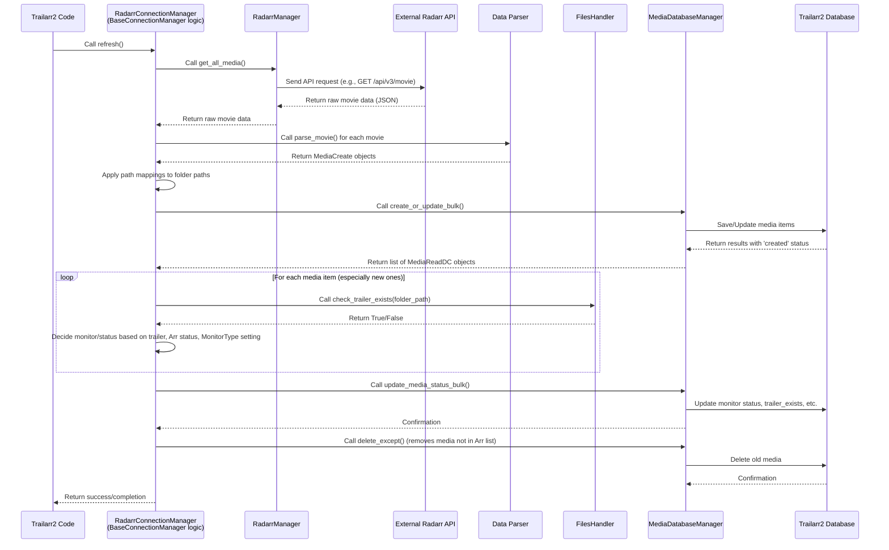

# Chapter 6: Arr Connection Managers

Welcome back to the Trailarr2 tutorial!

In our journey so far, we've built a solid foundation: we know *what* data Trailarr2 stores using [Database Models](01_database_models_.md), how it configures its behavior with [Application Settings](02_application_settings_.md), where the application starts running ([Main Application Entry](03_main_application_entry_.md)), how it talks to its own database ([Database Managers](04_database_managers_.md)), and how it interacts with files on your system ([File System Handler](05_file_system_handler_.md)).

Now, it's time to tackle a crucial piece: how does Trailarr2 discover all the movies and series you already have? Most people use dedicated applications like **Radarr** (for movies) or **Sonarr** (for TV series) to manage their media libraries. Trailarr2 needs to talk to *these* applications to know what you've got.

But Radarr and Sonarr each have their own way of communicating – their own specific "language" or **API (Application Programming Interface)**. Trailarr2 can't just guess how to ask for your movie list; it needs specialized tools that understand these languages.

This is where **Arr Connection Managers** come in.

## What are Arr Connection Managers? The Specialized Messengers

Imagine Radarr and Sonarr are countries that speak different languages. Trailarr2 needs to send and receive important messages (like "Give me your list of movies" or "Here's information about this series").

**Arr Connection Managers** are like **specialized messengers** or **translators** who know the language of a specific 'Arr' application (either Radarr or Sonarr). Their job is to:

1.  Take Trailarr2's request (like "sync my library").
2.  Translate that request into the specific API calls that Radarr or Sonarr understands.
3.  Send those calls over the network to the 'Arr' application.
4.  Receive the response back from the 'Arr' application (which is often raw data in their format).
5.  Translate that raw data into a format Trailarr2 understands and can use (like our [Database Models](01_database_models_.md)).
6.  Coordinate with other parts of Trailarr2 (like the [File System Handler](05_file_system_handler_.md) and [Database Managers](04_database_managers_.md)) to process the received information.

There isn't just one manager; there are separate managers for Radarr and Sonarr because they speak slightly different languages and handle movies/series differently. However, since they are similar types of applications, they share a lot of common logic, which is handled by a base manager.

## Our Guiding Use Case: Syncing Your Media Library

The most important job of an Arr Connection Manager is to **sync Trailarr2's database with your 'Arr' library**. This means:

*   Connecting to your Radarr/Sonarr instance.
*   Fetching the complete list of movies or series.
*   Comparing that list to what Trailarr2 currently has in its database.
*   Adding any new items found in the 'Arr' app to Trailarr2's database.
*   Updating information for existing items (like if they were marked as monitored in the 'Arr' app).
*   Marking items in Trailarr2 as needing a trailer or already having one.
*   Removing items from Trailarr2's database if they've been deleted from the 'Arr' app.

This entire process is orchestrated by the Arr Connection Managers.

## Understanding the Pieces

The Arr Connection Managers in Trailarr2 are built using a few interconnected parts:

1.  **`BaseConnectionManager`**: This is the foundation (in `backend/core/base/connection_manager.py`). It contains all the common logic that applies to *both* Radarr and Sonarr connections. This includes things like applying [Path Mappings](01_database_models_.md#our-guiding-example-defining-a-connection) (translating paths between systems), checking if a trailer file exists (using the [File System Handler](05_file_system_handler_.md)), deciding if an item should be monitored (using logic related to [Application Settings](02_application_settings_.md)), and interacting with the [Database Managers](04_database_managers_.md) to save/update media items. It defines a blueprint (called a `Protocol`) named `ArrManagerProtocol` for the actual API communication part.
2.  **`RadarrConnectionManager`** and **`SonarrConnectionManager`**: These are the specific managers (in `backend/core/radarr/connection_manager.py` and `backend/core/sonarr/connection_manager.py`). They inherit from `BaseConnectionManager` and add the Radarr- or Sonarr-specific details. Their main job is to tell the base class *which* API Manager and *which* data parser to use.
3.  **`RadarrManager`** and **`SonarrManager`**: These are the **API Managers** (in `backend/core/radarr/api_manager.py` and `backend/core/sonarr/api_manager.py`). They implement the `ArrManagerProtocol`. *This is where the actual network communication happens*. They know how to build the specific web requests (GET, POST, etc.) with the correct URLs and API keys for their application and handle the raw responses. They *don't* know anything about Trailarr2's database or file system; their only job is to talk to their 'Arr' counterpart.
4.  **Data Parsers (`parse_movie`, `parse_series`)**: These are functions (in `backend/core/radarr/data_parser.py` and `backend/core/sonarr/data_parser.py` - not explicitly shown in snippets, but implied by usage). They take the raw data received by the API Managers from Radarr/Sonarr and convert it into Trailarr2's structured format, specifically the `MediaCreate` [Database Model](01_database_models_.md).

Let's visualize this structure:

```mermaid
graph LR
    A[Trailarr2 Code] --> B{Uses Connection Manager};
    B --> C[RadarrConnectionManager];
    B --> D[SonarrConnectionManager];

    C --> E[BaseConnectionManager];
    D --> E;

    E --> F[RadarrManager];
    E --> G[SonarrManager];

    F -.-> ArrR[External Radarr API];
    G -.-> ArrS[External Sonarr API];

    E --> H[Data Parsers (parse_movie, parse_series)];
    E --> I[Database Managers];
    E --> J[File System Handler];

    I -.-> K[Trailarr2 Database];
    J -.-> L[File System];

    F & G -- Implements --> M[ArrManagerProtocol];

    subgraph Arr Connections
        C; D; E; F; G; H; M
    end

    subgraph Trailarr2 Core
        A; I; J; K; L
    end
```

This diagram shows that the specific `RadarrConnectionManager` and `SonarrConnectionManager` leverage the common `BaseConnectionManager`. The `BaseConnectionManager` then uses the correct **API Manager** (`RadarrManager` or `SonarrManager`) to get raw data, the **Data Parsers** to structure it, and the [Database Managers](04_database_managers_.md) and [File System Handler](05_file_system_handler_.md) to process and save it. The API Managers are the ones actually talking outside Trailarr2 to the external Radarr/Sonarr applications.

## Using an Arr Connection Manager (The Simple Way)

To sync a specific connection, Trailarr2 code (perhaps triggered by a scheduled task from [Task Scheduling](08_task_scheduling_.md) or a user action via the [Frontend API Services (Generated)](09_frontend_api_services__generated__.md)) would do something like this:

```python
# Imagine this code is part of a sync task

from core.radarr.connection_manager import RadarrConnectionManager
from core.base.database.models.connection import ConnectionRead # Need connection data

# Assume 'my_radarr_connection' is a ConnectionRead object
# fetched from the database (using a Database Manager!)
my_radarr_connection: ConnectionRead = ... # Get this from the database

# Create the specialized messenger for this specific connection
radarr_messenger = RadarrConnectionManager(my_radarr_connection)

# Ask the messenger to perform the sync/refresh operation
print(f"Starting refresh for connection: {my_radarr_connection.name}")
await radarr_messenger.refresh()
print("Refresh complete.")
```

Breaking this down:

1.  **`from core.radarr.connection_manager import RadarrConnectionManager`**: We import the specific manager for Radarr. If we were syncing a Sonarr connection, we'd import `SonarrConnectionManager`.
2.  **`my_radarr_connection: ConnectionRead = ...`**: We need the details of the connection (URL, API key, path mappings) which are stored in our database. This `ConnectionRead` object (defined in [Chapter 1](01_database_models_.md) and typically fetched by a [Database Manager](04_database_managers_.md)) is passed to the manager.
3.  **`radarr_messenger = RadarrConnectionManager(my_radarr_connection)`**: We create an *instance* of the manager, giving it the specific connection details. This creates our specialized messenger ready for action.
4.  **`await radarr_messenger.refresh()`**: We call the `refresh()` method. This is the main instruction that tells the manager to go perform the entire sync process. The `await` indicates this is an asynchronous operation, meaning the application can do other things while the manager is talking to the external 'Arr' API.

This is how other parts of Trailarr2 trigger a sync for a specific connection. They just create the right manager and call `refresh()`. All the complex steps of talking to the 'Arr' API, processing data, checking files, and updating the database are hidden inside the manager's `refresh` method.

## How Arr Connection Managers Work Under the Hood (The Messengers in Action)

Let's trace what happens when `radarr_messenger.refresh()` is called, using our sequence diagram participants:



This flow shows the core loop: fetch data from 'Arr' API, process it, check the file system, update Trailarr2's database, and finally clean up old entries. The Arr Connection Manager coordinates all these steps.

## Peeking Inside the Code

Let's look at simplified snippets to see how these pieces fit together.

First, how the specific managers (`RadarrConnectionManager`, `SonarrConnectionManager`) are set up:

```python
# From: backend/core/radarr/connection_manager.py (Simplified)
from core.base.connection_manager import BaseConnectionManager
from core.radarr.data_parser import parse_movie
from core.radarr.api_manager import RadarrManager
from core.base.database.models.connection import ConnectionRead

class RadarrConnectionManager(BaseConnectionManager):
    def __init__(self, connection: ConnectionRead):
        # Create the Radarr-specific API Manager
        radarr_manager = RadarrManager(connection.url, connection.api_key)

        # Initialize the BaseConnectionManager with Radarr's specifics
        super().__init__(
            connection,        # The connection details
            radarr_manager,    # The API Manager that talks to Radarr
            parse_movie,       # The function that translates raw Radarr data
            is_movie=True,     # Flag indicating this is for movies
        )

# From: backend/core/sonarr/connection_manager.py (Simplified)
from core.base.connection_manager import BaseConnectionManager
from core.sonarr.data_parser import parse_series # Uses a different parser
from core.sonarr.api_manager import SonarrManager # Uses a different API Manager
from core.base.database.models.connection import ConnectionRead

class SonarrConnectionManager(BaseConnectionManager):
    def __init__(self, connection: ConnectionRead):
        # Create the Sonarr-specific API Manager
        sonarr_manager = SonarrManager(connection.url, connection.api_key)

        # Initialize the BaseConnectionManager with Sonarr's specifics
        super().__init__(
            connection,        # The connection details
            sonarr_manager,    # The API Manager that talks to Sonarr
            parse_series,      # The function that translates raw Sonarr data
            is_movie=False,    # Flag indicating this is for series
        )
```

These snippets show how the specific managers primarily serve to instantiate their corresponding API Manager (`RadarrManager` or `SonarrManager`) and pass the correct parsing function (`parse_movie` or `parse_series`) up to the shared `BaseConnectionManager` during initialization (`super().__init__`).

Next, a simplified look at an API Manager fetching data:

```python
# From: backend/core/radarr/api_manager.py (Simplified)
from core.base.arr_manager.base import AsyncBaseArrManager # Base for API Managers

class RadarrManager(AsyncBaseArrManager):
    APPNAME = "Radarr"

    def __init__(self, url: str, api_key: str):
        # Initialize the base API Manager with URL and API Key
        super().__init__(url, api_key, "v3") # Radarr API version v3

    async def get_all_movies(self) -> list[dict[str, Any]]:
        """Get a list of movies from the Radarr API."""
        # Call the base API Manager's request method
        movies = await self._request("GET", f"/api/{self.version}/movie")
        if isinstance(movies, list):
            return movies # Return the raw list of movie data
        # Handle unexpected response
        raise InvalidResponseError("Invalid response from Radarr API")

    # Alias method used by BaseConnectionManager
    get_all_media = get_all_movies

# SonarrManager works similarly, but calls /api/v3/series
```

This snippet from `RadarrManager` shows it inheriting from a base API Manager (`AsyncBaseArrManager`, which handles the actual `_request` method to send HTTP calls – that's another layer of abstraction we don't need to detail here). Its `get_all_movies` method simply uses that inherited `_request` method to call the specific `/api/v3/movie` endpoint for Radarr. It returns the raw list of movies exactly as received from the Radarr API.

Finally, let's look at a simplified part of the `BaseConnectionManager`'s `refresh` logic, showing how it uses the API Manager, parser, File Handler, and Database Manager:

```python
# From: backend/core/base/connection_manager.py (Simplified)
from core.base.database.manager.base import MediaDatabaseManager # Database interaction
from core.files_handler import FilesHandler # File system interaction
# ... imports for ArrManagerProtocol, MediaCreate, MediaReadDC, etc. ...

class BaseConnectionManager(ABC):
    # ... __init__ stores self.arr_manager, self.parse_media, self.connection_id, etc. ...

    async def _parse_data(self) -> list[MediaCreate]:
        """Get raw data from Arr API and parse it."""
        logger.debug("Getting media data from Arr API")
        # Ask the specific API Manager (RadarrManager or SonarrManager)
        media_data = await self.arr_manager.get_all_media()
        logger.debug(f"Received {len(media_data)} items from Arr API")
        # Use the specific parser (parse_movie or parse_series)
        return [
            self.parse_media(self.connection_id, item)
            for item in media_data
        ]

    async def _process_media_list(self, parsed_media: list[MediaCreate]):
        """Process parsed media data: apply mappings, check files, update DB."""
        if not parsed_media:
            logger.warning("No media found or parsed.")
            return

        # Apply path mappings (uses connection.path_mappings)
        self._apply_path_mappings(parsed_media)

        # Create or update media in Trailarr2's database
        db_manager = MediaDatabaseManager() # Get the database librarian
        media_results = db_manager.create_or_update_bulk(parsed_media)

        # Now, iterate through the results to check file status and decide monitoring
        update_list: list[MediaUpdateDC] = []
        for media_read_dc in media_results: # media_results contains MediaReadDC with 'created' status
            trailer_exists = media_read_dc.trailer_exists # Start with current DB status

            # If it's a newly created entry, check the file system (uses FilesHandler)
            if media_read_dc.created and media_read_dc.folder_path:
                trailer_exists = await FilesHandler.check_trailer_exists(media_read_dc.folder_path)

            # Decide if it should be monitored (uses logic considering settings, trailer_exists, Arr status)
            monitor_media = self._check_monitoring(
                media_read_dc.created, trailer_exists, media_read_dc.arr_monitored
            )

            # Determine the final status (MONITORED, DOWNLOADED, MISSING, etc.)
            status = self._get_media_status(trailer_exists, monitor_media, media_read_dc.status)

            # Collect updates for the database
            update_list.append(
                MediaUpdateDC(
                    id=media_read_dc.id,
                    monitor=monitor_media,
                    status=status,
                    trailer_exists=trailer_exists,
                )
            )

        # Update the database with the new status and monitoring flags
        if update_list:
            db_manager.update_media_status_bulk(update_list)

        # Track IDs seen so we can remove others later
        # self.media_ids.extend([mr.id for mr in media_results]) # Actual code accumulates IDs

    async def refresh(self):
        """Gets new data from Arr API and saves/updates it in the database."""
        # Get and parse data in chunks (simplified here, original uses async generator)
        parsed_media_list = await self._parse_data() # Gets all data and parses it

        # Process the parsed data
        await self._process_media_list(parsed_media_list)

        # Remove media from DB that were not found in the latest Arr sync (uses Database Manager)
        # This needs the full list of IDs seen during the sync (accumulated in self.media_ids)
        # MediaDatabaseManager().delete_except(self.connection_id, self.media_ids)
        logger.debug("Cleanup of deleted media skipped in simplified example.")

        # Log summary counts (created/updated)
        # logger.info(f"... summary: {self.created_count} created, {self.updated_count} updated ...")

```

This snippet from `BaseConnectionManager` illustrates key points:
1.  `_parse_data` calls `self.arr_manager.get_all_media()` (talking to the external API) and then uses `self.parse_media()` (the specific parser) to convert the raw data.
2.  `_process_media_list` shows the loop over the parsed data, applying path mappings, using `MediaDatabaseManager` to `create_or_update_bulk`, then iterating again to use `FilesHandler.check_trailer_exists` and internal logic (`_check_monitoring`, `_get_media_status`) before using `MediaDatabaseManager` again to `update_media_status_bulk`.
3.  The simplified `refresh` orchestrates calls to `_parse_data` and `_process_media_list` and hints at the final cleanup step using a Database Manager.

This deep dive shows how the Arr Connection Managers coordinate interaction between external 'Arr' applications, Trailarr2's file system, and its own database.

## Summary and What's Next

In this chapter, we learned about **Arr Connection Managers**, the specialized messengers that allow Trailarr2 to communicate with external Radarr and Sonarr applications. We saw that they are composed of a common `BaseConnectionManager` and specific `RadarrConnectionManager` / `SonarrConnectionManager`, which in turn rely on **API Managers** to handle the direct network calls and **Data Parsers** to translate the raw data. We focused on their main job: syncing your media library by fetching data from the 'Arr' apps, applying necessary translations like path mappings, checking the file system using the [File System Handler](05_file_system_handler_.md), and updating Trailarr2's database using [Database Managers](04_database_managers_.md).

Now that Trailarr2 knows *what* media you have and *which* items need trailers, the next logical step is to actually find and download those trailers.

Ready to see how Trailarr2 gets the trailer files? Let's move on!

[Chapter 7: Trailer Download Core](07_trailer_download_core_.md)

---

Generated by [AI Codebase Knowledge Builder](https://github.com/The-Pocket/Tutorial-Codebase-Knowledge)