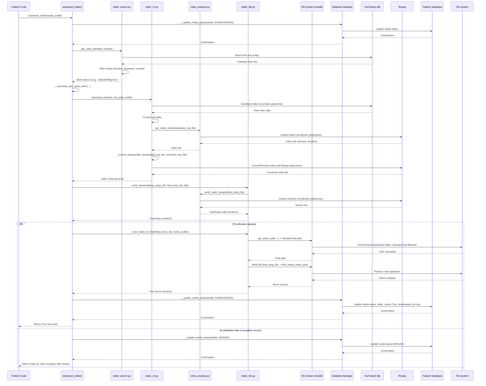

# Chapter 7: Trailer Download Core

Welcome back to the Trailarr2 tutorial!

In our previous chapters, we've built a picture of how Trailarr2 manages its data structure ([Database Models](01_database_models_.md)), configures its behavior ([Application Settings](02_application_settings_.md)), starts up ([Main Application Entry](03_main_application_entry_.md)), talks to its database ([Database Managers](04_database_managers_.md)), interacts with your file system ([File System Handler](05_file_system_handler_.md)), and discovers your media library by connecting to applications like Radarr and Sonarr ([Arr Connection Managers](06_arr_connection_managers_.md)).

Now that Trailarr2 knows *which* movies and series you have and *which* of them are missing trailers, it's time for the core action: finding and getting those missing trailers.

## What is the Trailer Download Core? The Trailer Factory

Imagine you have a list of ingredients (your media items) that need a specific component (a trailer). The **Trailer Download Core** is like a specialized **trailer factory** within Trailarr2. Its job is to take that list of needed trailers and produce the finished video files, ready to be placed next to your media.

This factory is responsible for the entire process, from finding the right trailer online to producing a video file with the correct format and quality settings you've chosen in your [Application Settings](02_application_settings_.md) and [Trailer Profiles](01_database_models_.md).

The Trailer Download Core handles:
*   Searching online platforms (like YouTube) for the correct trailer.
*   Downloading the video data.
*   Converting the video to meet your preferred quality and format specifications.
*   Making sure the downloaded and converted file is valid.
*   Ensuring the final file is saved in the right place using the correct name format.

## Our Guiding Use Case: Downloading a Single Trailer

Let's focus on the central task: getting a trailer for one specific movie or series that Trailarr2 has identified as needing one.

This media item will have information like its title, year, and folder path (all stored as a `MediaRead` object, thanks to [Database Models](01_database_models_.md) and [Arr Connection Managers](06_arr_connection_managers_.md)). Trailarr2 also needs to know *how* you want the trailer downloaded (e.g., 1080p, MP4, specific naming) – this information comes from a `TrailerProfileRead` object.

The Trailer Download Core takes these two pieces of information and gets the job done.

## Using the Trailer Download Core (The Simple Way)

The main entry point for downloading a single trailer is typically a function like `download_trailer` found in `backend/core/download/trailer.py`.

Any part of Trailarr2 that needs to download a trailer for a specific media item will call this function:

```python
# Imagine this code is part of a task processing missing trailers

from core.download.trailer import download_trailer
from core.base.database.models.media import MediaRead # Represents the media item
from core.base.database.models.trailerprofile import TrailerProfileRead # Your download settings

# Assume 'my_movie' is a MediaRead object for a movie needing a trailer
my_movie: MediaRead = ... # Get this from the database (via Database Manager)

# Assume 'my_profile' is a TrailerProfileRead object with desired settings
my_profile: TrailerProfileRead = ... # Get this from the database (via Database Manager)

# Call the trailer download core function
print(f"Attempting to download trailer for {my_movie.title}...")
success = download_trailer(my_movie, my_profile)

if success:
    print(f"Successfully downloaded trailer for {my_movie.title}")
else:
    print(f"Failed to download trailer for {my_movie.title}")
```

Let's break this simple example:

1.  **`from core.download.trailer import download_trailer`**: We import the main function from the trailer download core.
2.  **`my_movie: MediaRead = ...`** and **`my_profile: TrailerProfileRead = ...`**: We obtain the necessary information about the media item and the desired download settings. This information is usually loaded from the database using [Database Managers](04_database_managers_.md).
3.  **`success = download_trailer(my_movie, my_profile)`**: We call the `download_trailer` function, passing the media information and the profile settings. This function orchestrates the entire process.
4.  **Check the result:** The function returns `True` if the download and saving were successful, and `False` otherwise.

From the perspective of using the core, it's as simple as calling this function. All the complexity of searching, downloading, converting, and saving is handled internally by the core components.

## How the Trailer Download Core Works Under the Hood (The Factory Process)

When you call `download_trailer`, the trailer factory kicks into gear, coordinating several specialized machines:

1.  **Search Machine (trailer_search.py):** First, it needs to find the correct trailer. It checks if the `Media` object already has a potential YouTube ID stored. If not, it uses a search tool (based on `yt-dlp`) to look on YouTube using a search query formatted based on your [Application Settings](02_application_settings_.md) and the media's details. It applies filters based on duration limits and excluded words from settings and [Trailer Profiles](01_database_models_.md).
2.  **Download Machine (video_v2.py using yt-dlp):** Once a YouTube video ID is found, it passes the URL to the download machine. This machine uses a powerful tool called **yt-dlp** (a popular command-line video downloader) via a Python `subprocess` to fetch the video data from YouTube based on the specified quality and format preferences from the `TrailerProfile`.
3.  **Conversion/Processing Machine (video_v2.py and video_analysis.py using ffmpeg):** YouTube videos aren't always in the perfect format or codec. The downloaded video is then sent to the conversion machine. This machine uses another powerful tool called **ffmpeg** (a command-line video and audio processor) via `subprocess`. Ffmpeg converts the video to the target format, codec, and resolution specified in the `TrailerProfile`. It can also perform extra tasks like adjusting volume or removing silence at the end of the video (using logic from `video_analysis.py`). It might attempt hardware acceleration (NVIDIA) if enabled in [Application Settings](02_application_settings_.md) and supported.
4.  **Verification Check (trailer_file.py and video_analysis.py):** After downloading and converting, a check is performed (using `video_analysis.verify_trailer_streams`). Does the file actually exist? Does it have both audio and video streams? Is the duration within the expected range? This ensures the downloaded file isn't corrupt or incomplete.
5.  **Saving & Naming (trailer_file.py using File System Handler):** If the file passes verification, the core needs to put it in the right place with the right name. It uses logic from `trailer_file.py` to determine the final destination path and filename based on the `TrailerProfile` settings (subfolder, naming template) and the media item's folder path. It then asks the [File System Handler](05_file_system_handler_.md) to safely move the file from a temporary directory to its final destination, handling potential filename conflicts.
6.  **Status Update (trailer.py using Database Managers):** Throughout this process, the core updates the status of the media item in Trailarr2's database (using a [Database Manager](04_database_managers_.md)). It might set the status to `DOWNLOADING`, then `DOWNLOADED` on success, or `MISSING` if the process fails after retries.
7.  **Error Handling & Retries (trailer.py):** If any step fails (search finds no trailer, download fails, conversion fails), the core handles the error, logs it, updates the media status, and might retry the process up to a certain limit (as specified in `download_trailer`).

Here's a simplified sequence diagram illustrating the main steps for a successful download:


This diagram shows how `download_trailer` acts as the coordinator, calling out to the different modules (`trailer_search`, `video_v2`, `trailer_file`, `video_analysis`) and ultimately interacting with external command-line tools (`yt-dlp`, `ffmpeg`/`ffprobe`), the file system, and the database.

## Peeking Inside the Code

Let's look at simplified snippets of the key components mentioned above.

First, the central `download_trailer` function (from `backend/core/download/trailer.py`):

```python
# From: backend/core/download/trailer.py (Simplified)
from core.download.video_v2 import download_video
from core.download import trailer_file, trailer_search # Import the helpers
from core.base.database.manager.base import MediaDatabaseManager # Database interaction
from core.base.database.models.media import MediaRead, MonitorStatus
from core.base.database.models.trailerprofile import TrailerProfileRead
from exceptions import DownloadFailedError
# Assume logger and __update_media_status are defined

def download_trailer(
    media: MediaRead,
    profile: TrailerProfileRead,
    retry_count: int = 2,
    exclude: list[str] | None = None,
) -> bool:
    logger.info(f"Downloading trailer for {media.title} [{media.id}]")
    if exclude is None:
        exclude = []

    # Ignore current trailer ID if always_search is enabled in profile
    if profile.always_search and media.youtube_trailer_id:
        exclude.append(media.youtube_trailer_id)
        media.youtube_trailer_id = None # Clear it for search

    # 1. Find the video ID (search if needed)
    video_id = trailer_search.get_video_id(media, exclude)
    if not video_id:
        logger.error(f"No trailer found for {media.title}")
        __update_media_status(media, MonitorStatus.MISSING)
        return False # No ID found, cannot download

    try:
        # 2. Update status to indicate download is starting
        __update_media_status(media, MonitorStatus.DOWNLOADING)

        # 3. Download and verify the trailer
        output_file_temp = __download_and_verify_trailer(media, video_id, profile)

        # 4. Move the trailer to the final media folder
        trailer_file.move_trailer_to_folder(output_file_temp, media, profile)

        # 5. Update status to indicate successful download
        __update_media_status(media, MonitorStatus.DOWNLOADED)
        logger.info(f"Trailer downloaded successfully for {media.title}")
        return True

    except Exception as e:
        logger.error(f"Failed download attempt for {media.title}: {e}")
        # Handle retries and update status if retries exhausted
        if retry_count > 0:
            logger.info(f"Retrying download for {media.title}... ({3 - retry_count}/3)")
            # Add the failed video_id to exclude list for the retry
            if video_id:
                 exclude.append(video_id)
            return download_trailer(media, profile, retry_count - 1, exclude)
        else:
            __update_media_status(media, MonitorStatus.MISSING)
            # Re-raise or log final failure
            logger.error(f"Final download attempt failed for {media.title}")
            return False # Indicate failure
```
This simplified `download_trailer` function shows how it orchestrates calls to `trailer_search`, `__download_and_verify_trailer` (which we'll see uses `video_v2`), `trailer_file.move_trailer_to_folder`, and calls `__update_media_status` to keep the database status current using a [Database Manager](04_database_managers_.md). It also includes basic retry logic.

Next, how the search works (from `backend/core/download/trailer_search.py`):

```python
# From: backend/core/download/trailer_search.py (Simplified)
from yt_dlp import YoutubeDL # The tool for searching/downloading
from config.settings import app_settings # For getting settings
from core.base.database.models.media import MediaRead # The media object
# Assume logger and _yt_search_filter are defined

def get_video_id(
    media: MediaRead, exclude: list[str] | None = None
) -> str | None:
    """Get youtube video id for the media object. Search if not found."""
    video_id = ""
    # Check if youtube_trailer_id is already stored (e.g., from Arr)
    if media.youtube_trailer_id:
        video_id = extract_youtube_id(media.youtube_trailer_id) # Helper to parse URL
    if video_id:
        logger.debug(f"Using stored YouTube ID: {video_id}")
        return video_id # Found a stored ID, use it

    # If no stored ID, search YouTube
    logger.debug(f"No stored ID, searching YouTube for '{media.title}'...")
    video_id = search_yt_for_trailer(media, exclude) # Call the search function
    return video_id

def search_yt_for_trailer(
    media: MediaRead,
    exclude: list[str] | None = None,
) -> str | None:
    """Search for trailer on youtube using yt-dlp."""
    logger.debug(f"Searching youtube for trailer for '{media.title}'...")
    filter_func = partial(_yt_search_filter, exclude=exclude) # Apply our filters
    options = {
        "format": "bestvideo[height<=?1080]+bestaudio", # Desired initial quality
        "match_filter": filter_func, # Apply our duration/keyword filters
        "noplaylist": True,
        "quiet": True, # Don't print noisy output from yt-dlp directly
        # ... other options from settings like cookies_path ...
    }

    # Construct the search query string based on settings and media info
    search_query = app_settings.trailer_search_query.format(**media.model_dump())
    search_query = f"ytsearch10: {search_query} trailer" # Search prefix, max 10 results

    # Use YoutubeDL library to perform the search
    with YoutubeDL(options) as ydl:
        search_results = ydl.extract_info(search_query, download=False, process=True)

    # Process results and return the first valid video ID
    if not search_results or not isinstance(search_results, dict) or "entries" not in search_results:
        return None

    for result in search_results["entries"]:
        # _yt_search_filter is also applied here internally by yt-dlp due to match_filter option
        logger.debug(f"Found potential trailer: {result['id']} - {result['title']}")
        return str(result["id"]) # Return the first promising ID found

    return None # No valid trailer found after searching and filtering
```
This snippet shows how `get_video_id` first tries the stored ID and falls back to `search_yt_for_trailer`. `search_yt_for_trailer` uses `yt_dlp.YoutubeDL` to perform the search, building the query and options based on `app_settings` and the `Media` object. It applies a custom filter (`_yt_search_filter`, not shown but handles duration/keywords/exclusions) to narrow down results.

Next, the core download and conversion logic (from `backend/core/download/video_v2.py`):

```python
# From: backend/core/download/video_v2.py (Simplified)
import subprocess # To run external commands like yt-dlp and ffmpeg
import os
import time
# Assume logger, _get_ytdl_options, _get_ffmpeg_cmd are defined
from exceptions import DownloadFailedError, ConversionFailedError
from core.base.database.models.trailerprofile import TrailerProfileRead # For settings
from core.download import video_analysis # For analysis/verification

def _download_with_ytdlp(
    url: str, file_path: str, profile: TrailerProfileRead
) -> str:
    """Download the video using yt-dlp from the given URL"""
    ytdlp_cmd: list[str] = ["yt-dlp", "-o", file_path]
    ytdlp_cmd.extend(_get_ytdl_options(profile)) # Get download options based on profile
    ytdlp_cmd.append(url)

    logger.debug(f"Downloading with yt-dlp: {ytdlp_cmd}")
    # Run yt-dlp as a subprocess
    with subprocess.Popen(ytdlp_cmd, stdout=subprocess.PIPE, stderr=subprocess.PIPE, text=True) as process:
       # Read output/errors for logging and error detection (like age restrictions)
       # ... simplified error handling ...
       pass # Wait for process to finish

    if process.returncode != 0:
        # Handle process failure
        raise DownloadFailedError(f"yt-dlp download failed: {process.returncode}")

    logger.info("yt-dlp download successful")
    # yt-dlp replaces %(ext)s placeholder, need to get the actual output filename
    return file_path.replace("%(ext)s", profile.file_format) # Simplified file name guessing


def _convert_video(
    profile: TrailerProfileRead, input_file: str, output_file: str, retry=True
) -> str:
    """Convert the video to the desired format using ffmpeg."""
    # Get the ffmpeg command based on profile, input/output files, and hardware acceleration settings
    ffmpeg_cmd = get_ffmpeg_cmd(profile, input_file, output_file, fallback=not retry)

    logger.debug(f"Converting with ffmpeg: {ffmpeg_cmd}")
    # Run ffmpeg as a subprocess
    with subprocess.Popen(ffmpeg_cmd, stdout=subprocess.PIPE, stderr=subprocess.PIPE, text=True) as process:
        # Read output/errors for logging
        # ...
        pass # Wait for process to finish

    if process.returncode != 0:
        # Handle conversion failure, potentially retry without hardware acceleration
        if retry:
            logger.warning("FFmpeg conversion failed, retrying...")
            return _convert_video(profile, input_file, output_file, retry=False)
        # If retries exhausted, raise final error
        raise ConversionFailedError(f"FFmpeg conversion failed: {process.returncode}")

    logger.info("FFmpeg conversion successful")
    return "Video converted successfully" # Return confirmation message


def download_video(
    url: str, file_path: str, profile: TrailerProfileRead
) -> str:
    """Download and convert a video."""
    # Use a temporary file path
    temp_file_path = f"/app/tmp/temp_{os.path.basename(file_path)}"
    # Ensure temp directory exists (handled by File System Handler implicitly or setup)
    os.makedirs(os.path.dirname(temp_file_path), exist_ok=True)

    # 1. Download using yt-dlp
    downloaded_file = _download_with_ytdlp(url, temp_file_path, profile)

    # 2. Convert using ffmpeg
    converted_file = downloaded_file.replace("temp_", "converted_") # New temp name after conversion
    _convert_video(profile, downloaded_file, converted_file)

    # Clean up the first downloaded file
    os.remove(downloaded_file)

    logger.info("Download and conversion steps completed")
    return converted_file # Return path to the converted file
```
This simplified `video_v2.py` code shows the core download (`_download_with_ytdlp` using `yt-dlp` via `subprocess`) and conversion (`_convert_video` using `ffmpeg` via `subprocess`) steps. It manages temporary files during this process. The detailed options for `yt-dlp` and `ffmpeg` are generated by helper functions (`_get_ytdl_options`, `get_ffmpeg_cmd`, `_get_video_options`, `_get_audio_options`, etc., not shown in full) based on the `TrailerProfile` and potentially hardware availability ([Application Settings](02_application_settings_.md)).

Finally, the verification and saving steps (from `backend/core/download/trailer_file.py` and `backend/core/download/video_analysis.py`):

```python
# From: backend/core/download/trailer_file.py (Simplified)
import os
import shutil # For moving files
from core.base.database.models.media import MediaRead
from core.base.database.models.trailerprofile import TrailerProfileRead
from core.download import video_analysis # For verification
from exceptions import FolderNotFoundError, FolderPathEmptyError
# Assume logger, get_trailer_filename, normalize_filename, get_folder_permissions are defined

def verify_download(
    tmp_output_file: str, output_file: str, title: str
) -> bool:
    """Verify if the trailer is downloaded successfully and has streams."""
    logger.debug(f"Verifying download: {output_file}")
    # Check if the output file from conversion exists
    if not output_file or not os.path.exists(output_file):
        logger.error(f"Converted file not found: {output_file}")
        return False

    # Use video_analysis to check for audio/video streams and duration limits
    # (Simplified call, actual verify_trailer_streams takes the output_file)
    is_valid_trailer = video_analysis.verify_trailer_streams(output_file)

    if not is_valid_trailer:
        logger.debug(f"Trailer verification failed for {title}: missing streams or invalid duration")
        # Optionally delete the invalid file here
        return False

    logger.debug(f"Trailer verification successful for {title}")
    return True # Verification passed!

def move_trailer_to_folder(
    src_path: str, media: MediaRead, profile: TrailerProfileRead
) -> bool:
    """Move the trailer file from temp location to the specified media folder."""
    logger.debug(f"Moving trailer from '{src_path}' to '{media.folder_path}'")
    if not os.path.exists(src_path):
        raise FileNotFoundError(f"Source trailer file not found: {src_path}")
    if not media.folder_path or not os.path.exists(media.folder_path):
         raise FolderNotFoundError(folder_path=media.folder_path) # Use File System Handler implicitly

    # Determine destination folder (media folder or subfolder)
    dst_folder_path = media.folder_path
    if profile.folder_enabled:
        folder_name = profile.folder_name or "Trailers"
        dst_folder_path = os.path.join(media.folder_path, folder_name)
        # Ensure destination folder exists (handled by File System Handler logic implicitly)
        os.makedirs(dst_folder_path, exist_ok=True) # Explicitly create if needed

    # Get the final destination path with correct filename and index
    dst_file_path = get_trailer_path(src_path, dst_folder_path, media)

    # Move the file using shutil (uses OS file system operations)
    shutil.move(src_path, dst_file_path)
    logger.debug(f"Trailer moved successfully to '{dst_file_path}'")

    # Set file permissions (optional, often handled implicitly by OS/umask, but can be explicit)
    # os.chmod(dst_file_path, get_folder_permissions(dst_folder_path)) # Use File System Handler logic

    return True
```
These snippets show how `trailer_file.verify_download` uses `video_analysis.verify_trailer_streams` (which in turn uses `ffprobe` via `subprocess` to analyze the file's streams) to check the file integrity. Then, `trailer_file.move_trailer_to_folder` calculates the final path using `get_trailer_path` (which uses `get_trailer_filename` based on the `TrailerProfile` and `media` object, and `normalize_filename` for safety) and finally uses `shutil.move` to perform the actual file movement. The logic for checking/creating the destination folder relies on basic OS calls, conceptually part of what a [File System Handler](05_file_system_handler_.md) provides.

All these components work together seamlessly under the coordination of the `download_trailer` function to perform the complex task of finding, downloading, converting, verifying, and saving a trailer.

## Role of Settings and Profiles

The Trailer Download Core heavily relies on [Application Settings](02_application_settings_.md) (`app_settings`) and the specific `TrailerProfileRead` object passed to `download_trailer`. These inputs dictate:

*   **Search Query:** How to format the YouTube search term (`app_settings.trailer_search_query`).
*   **Search Filters:** Minimum/maximum duration, excluded words (`app_settings.trailer_min_duration`, `app_settings.trailer_max_duration`, `app_settings.exclude_words`).
*   **Download Format/Quality:** Preferred video and audio codecs, resolution, file container format (`profile.video_format`, `profile.audio_format`, `profile.video_resolution`, `profile.file_format`).
*   **Conversion Settings:** Whether to use hardware acceleration (`app_settings.nvidia_gpu_available` and `app_settings.trailer_hardware_acceleration`), target codecs/quality parameters for ffmpeg.
*   **Audio Processing:** Whether to adjust volume or remove silence (`profile.audio_volume_level`, `profile.remove_silence`).
*   **Subtitles:** Whether to download and embed subtitles, and in which language (`profile.subtitles_enabled`, `profile.subtitles_language`, `profile.subtitles_format`).
*   **Metadata:** Whether to embed metadata (`profile.embed_metadata`).
*   **Saving Location:** Whether to create a subfolder and its name (`profile.folder_enabled`, `profile.folder_name`).
*   **File Naming:** The template used to generate the final filename (`app_settings.trailer_file_name`).
*   **YouTube Cookies:** Path to a cookies file for handling age-restricted content (`app_settings.yt_cookies_path`).
*   **Always Search:** Whether to ignore a stored YouTube ID and always search fresh (`profile.always_search`).

These settings make the Trailer Download Core highly configurable to your specific needs and preferences.

## Summary and What's Next

In this chapter, we explored the **Trailer Download Core**, the heart of Trailarr2's trailer processing. We saw that it's like a factory, orchestrating the complex steps of finding, downloading, converting, verifying, and saving trailer files using external tools like **yt-dlp** and **ffmpeg** via `subprocess`. We learned how it relies on [Application Settings](02_application_settings_.md) and [Trailer Profiles](01_database_models_.md) for its configuration and interacts with the [File System Handler](05_file_system_handler_.md) and [Database Managers](04_database_managers_.md) to manage files and update media status.

Now that Trailarr2 knows *how* to download a trailer, the next question is *when* should it do it? Manually triggering every download isn't practical for a large library. This is where automation comes in.

Ready to learn how Trailarr2 decides when to perform tasks like syncing your library or downloading trailers automatically? Let's move on!

[Chapter 8: Task Scheduling](08_task_scheduling_.md)

---

Generated by [AI Codebase Knowledge Builder](https://github.com/The-Pocket/Tutorial-Codebase-Knowledge)