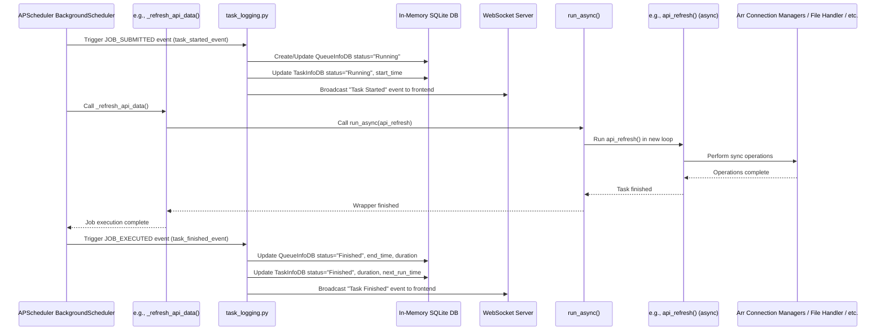

# Chapter 8: Task Scheduling

Welcome back to the Trailarr2 tutorial!

In our previous chapter, [Chapter 7: Trailer Download Core](07_trailer_download_core_.md), we learned how Trailarr2 finds, downloads, converts, and saves a single trailer file. We saw how it uses external tools and relies on your configurations ([Application Settings](02_application_settings_.md) and [Trailer Profiles](01_database_models_.md)).

But imagine you have hundreds or thousands of movies and series! You wouldn't want to manually trigger the download process for each one, or even manually tell Trailarr2 to check your media servers every hour. Applications like Trailarr2 need to be able to do things automatically, in the background, on a regular basis.

This is where **Task Scheduling** comes in.

## What is Task Scheduling? The App's Calendar

Think of Trailarr2 as having a list of important chores it needs to do:
*   Check Radarr/Sonarr for new movies/series.
*   Look at your media folders to see if trailers were added or removed manually.
*   Download trailers for items marked as missing.
*   Clean up old temporary files.
*   Maybe even check for software updates.

The **Task Scheduling** component acts like Trailarr2's **calendar, clock, and to-do list manager** all rolled into one. Its job is to make sure these important chores run automatically at the right times or intervals, without you having to lift a finger after the initial setup.

It works like a background assistant that constantly checks the clock and a list of scheduled jobs, saying things like: "Okay, it's been an hour, time to sync with Radarr!" or "It's midnight, time for cleanup!".

## Our Guiding Use Case: Syncing with Radarr/Sonarr Automatically

One of the most frequent and critical tasks is keeping Trailarr2's database in sync with your media servers (Radarr/Sonarr). You want Trailarr2 to automatically check for new media you've added, updates to existing media, or items you've removed.

You want this to happen regularly, perhaps every hour, without you having to click a button. This is a perfect example of a task handled by the scheduler.

## How to Use Task Scheduling (Setting the Schedule)

Trailarr2 uses a powerful Python library called `APScheduler` (Advanced Python Scheduler) to manage its tasks. You don't typically interact with the scheduler directly in most parts of the application. Instead, during the application's startup (handled by the [Main Application Entry](03_main_application_entry_.md)), a central function is called that *defines* and *adds* all the necessary tasks to the scheduler.

This function is `schedule_all_tasks()` (found in `backend/core/tasks/schedules.py`).

When Trailarr2 starts, it runs this function, which essentially tells the scheduler: "Here are the jobs you need to remember, and here's when you should run them."

Here's a simplified look at what `schedule_all_tasks()` does:

```python
# From: backend/core/tasks/schedules.py (Simplified)
from . import scheduler # Import the scheduler instance
from .api_refresh import api_refresh # The function to sync Arr data
from .files_scan import scan_disk_for_trailers # The function to scan disk
from .cleanup import trailer_cleanup # The function to clean up
from .download.trailers.missing import download_missing_trailers # The function to download trailers
from datetime import datetime, timedelta
from config.settings import app_settings # To get intervals from settings

logger = ModuleLogger("BackgroundTasks") # Our logger

def refresh_api_data_job():
    """Schedules the Arr data refresh job."""
    scheduler.add_job(
        func=_refresh_api_data, # The function to run
        trigger="interval",     # How often to run
        minutes=app_settings.monitor_interval, # The interval from settings!
        id="hourly_refresh_api_data_job", # A unique ID for the job
        name="Arr Data Refresh", # A friendly name
        next_run_time=datetime.now() + timedelta(seconds=30), # When to run first
        max_instances=1, # Don't run multiple at the same time
    )
    logger.info("API Refresh job scheduled!")

# ... similar functions for other jobs like scan_disk_for_trailers_job,
# download_missing_trailers_job, trailer_cleanup_job, etc.

def schedule_all_tasks():
    """Schedules all tasks for the application."""
    logger.info("Scheduling all background tasks!")
    refresh_api_data_job() # Schedule the API refresh
    scan_disk_for_trailers_job() # Schedule the disk scan
    download_missing_trailers_job() # Schedule the trailer download
    trailer_cleanup_job() # Schedule the cleanup
    # ... and other jobs ...
    logger.info("All tasks scheduled!")
```

This snippet shows the pattern: `schedule_all_tasks` calls individual functions like `refresh_api_data_job`. Each of these functions then calls `scheduler.add_job()`, which is the core command to register a task with the scheduler.

The `add_job` method needs a few key pieces of information:
*   `func`: The Python function that should be executed when the job runs.
*   `trigger`: Specifies *when* the function should run. Common triggers are `"interval"` (run every X minutes/hours/days), `"date"` (run once at a specific time), or `"cron"` (run like a cron job, allowing complex schedules like "every Monday at 9 AM").
*   `minutes`/`hours`/`days`/`run_date`: Parameters for the chosen trigger. Notice how the interval for the API refresh comes from `app_settings.monitor_interval`, making it configurable!
*   `id`: A unique string to identify the job (useful for managing it later).
*   `name`: A human-readable name for the job.
*   `next_run_time`: When the job should run for the *first* time after the application starts. This prevents all hourly jobs from running simultaneously right at startup.
*   `max_instances`: Ensures that if a job is already running when its next scheduled time arrives, the scheduler waits for the current instance to finish before potentially starting another, preventing overload.

So, the "usage" of task scheduling is primarily defining these `*_job` functions and calling `scheduler.add_job` within the `schedule_all_tasks` function during startup.

## How Task Scheduling Works Under the Hood (The Clock and Assistants)

Let's look at the internal parts of the Task Scheduling component, primarily located in `backend/core/tasks/`.

1.  **The Scheduler Instance (__init__.py):** The heart is the `scheduler` object created using `APScheduler.BackgroundScheduler`. This object runs in the background (in a separate thread or process) and is responsible for keeping track of all the registered jobs and triggering them when their time comes.

    ```python
    # From: backend/core/tasks/__init__.py (Simplified)
    from apscheduler.schedulers.background import BackgroundScheduler
    from app_logger import ModuleLogger
    import os

    timezone = os.getenv("TZ", "UTC") # Use timezone from settings
    tasks_logger = ModuleLogger("Tasks")

    scheduler = BackgroundScheduler(
        timezone=timezone,
        logger=tasks_logger
        # Job stores, executors omitted for simplicity, see snippet
    )

    # add_all_event_listeners(scheduler) # Add logging/status listeners
    ```
    This creates the background scheduler instance that will run the jobs.

2.  **Job Definition (schedules.py):** As seen above, `schedules.py` contains the logic to define *which* functions run and *when* by calling `scheduler.add_job`. The actual functions being scheduled (`api_refresh`, `scan_disk_for_trailers`, etc.) live in separate files within the `backend/core/tasks/` directory (e.g., `api_refresh.py`, `files_scan.py`).

3.  **Handling Asynchronous Tasks (schedules.py):** Most of Trailarr2's core logic (like interacting with Arr APIs or downloading trailers) uses asynchronous programming (`asyncio`). APScheduler needs to run these functions. The `run_async` helper function is used to wrap these async functions, allowing the synchronous APScheduler to execute them correctly in their own event loop.

    ```python
    # From: backend/core/tasks/schedules.py (Simplified)
    import asyncio

    def run_async(task) -> None:
        """Run the async task in a separate event loop."""
        new_loop = asyncio.new_event_loop()
        asyncio.set_event_loop(new_loop)
        try:
            new_loop.run_until_complete(task())
        finally:
            new_loop.close()

    def _refresh_api_data():
        """Refreshes data from Arr APIs."""
        # Call the async function using the wrapper
        run_async(api_refresh)

    # This _refresh_api_data function is what gets added to scheduler.add_job
    ```
    When the scheduler triggers `_refresh_api_data`, the `run_async` wrapper creates a temporary environment to run the `api_refresh` function (which is `async def`) asynchronously.

4.  **Task Status Logging (task_logging.py):** Trailarr2 provides a way to see the status of scheduled and recently run tasks in the frontend. This is managed by listening to events from the APScheduler and storing basic information (task name, last run time, duration, status, next run time) in a simple in-memory database.

    ```python
    # From: backend/core/tasks/task_logging.py (Simplified)
    from apscheduler import events
    from apscheduler.schedulers.base import BaseScheduler
    from sqlmodel import SQLModel, Field, Session, create_engine, select
    from datetime import datetime, timezone
    from contextlib import contextmanager

    # Simple in-memory database setup (uses SQLite :memory:)
    engine = create_engine("sqlite:///:memory:")
    SQLModel.metadata.create_all(engine)

    class TaskInfoDB(SQLModel, table=True):
        # Model to store scheduled task info
        id: int | None = Field(default=None, primary_key=True)
        task_id: str
        name: str
        interval: int = Field(default=0) # How often it should run (if scheduled)
        last_run_duration: int = Field(default=0)
        last_run_start: datetime | None = Field(default=None)
        last_run_status: str = Field(default="Not Run Yet")
        next_run: datetime | None = Field(default=None)
        scheduled: bool = Field(default=True)

    class QueueInfoDB(SQLModel, table=True):
        # Model to store information about individual task runs (the queue)
        id: int | None = Field(default=None, primary_key=True)
        queue_id: str # Matches task_id or a unique run ID
        name: str
        duration: int = Field(default=0)
        finished: datetime | None = Field(default=None)
        started: datetime = Field(default_factory=get_current_time)
        status: str = Field(default="Queued")

    # Helper functions to get/save/update TaskInfoDB and QueueInfoDB
    @contextmanager
    def _get_session():
        # Database session manager
        ...

    def update_task(task_data: TaskInfo):
        # Logic to find/update TaskInfoDB in memory DB
        ...

    def update_queue(queue_data: QueueInfo):
        # Logic to find/update QueueInfoDB in memory DB
        ...

    # Event handler functions
    def task_started_event(event: events.JobEvent) -> None:
        # Called when a job starts
        task_id = event.job_id
        now = get_current_time()
        # Update TaskInfoDB (set last_run_start, status="Running")
        # Create/Update QueueInfoDB (set started=now, status="Running")
        update_task(...) # Use helpers
        update_queue(...) # Use helpers
        # Send websocket broadcast to frontend (see websocket chapter)
        # websockets.broadcast(...)

    def task_finished_event(event: events.JobEvent, status: str = "Finished") -> None:
        # Called when a job finishes or errors
        task_id = event.job_id
        now = get_current_time()
        # Update TaskInfoDB (set last_run_duration, last_run_status, next_run)
        # Update QueueInfoDB (set finished=now, duration, status)
        update_task(...) # Use helpers
        update_queue(...) # Use helpers
        # Send websocket broadcast to frontend
        # websockets.broadcast(...)

    def task_error_event(event: events.JobEvent) -> None:
        task_finished_event(event, status="Error")

    # Function to add these listeners to the scheduler
    def add_all_event_listeners(scheduler: BaseScheduler):
        scheduler.add_listener(task_started_event, events.EVENT_JOB_SUBMITTED)
        scheduler.add_listener(task_finished_event, events.EVENT_JOB_EXECUTED)
        scheduler.add_listener(task_error_event, events.EVENT_JOB_ERROR)
        # Also handles JOB_ADDED, JOB_REMOVED, etc.
        ...

    ```
    This module defines models (`TaskInfoDB`, `QueueInfoDB`) for storing task status, sets up a minimal in-memory database, and contains functions (`task_started_event`, `task_finished_event`, `task_error_event`) that are triggered by APScheduler events. These functions update the status in the in-memory database and send notifications to the frontend. The `add_all_event_listeners` function connects these handlers to the scheduler instance.

Here's a simplified flow of a scheduled task running:



This diagram illustrates how the scheduler triggers the wrapper function, which then runs the actual asynchronous task logic. During this process, event listeners in `task_logging.py` update the status in the in-memory database and notify the frontend via WebSockets (which we'll learn about in a later chapter).

5.  **Integration with Lifespan (main.py):** Finally, the scheduler needs to be started when Trailarr2 starts and shut down cleanly when it stops. As seen in [Chapter 3: Main Application Entry](03_main_application_entry_.md), this is handled in the `lifespan` function in `main.py`:

    ```python
    # From: backend/main.py (Simplified lifespan)
    from contextlib import asynccontextmanager
    from core.tasks import scheduler # The scheduler instance
    from core.tasks.schedules import schedule_all_tasks # The function to schedule jobs

    @asynccontextmanager
    async def lifespan(app: FastAPI):
        # --- Startup ---
        logging.debug("Scheduling tasks")
        schedule_all_tasks() # Call the function to add all jobs
        scheduler.start() # Start the background scheduler thread/process
        logging.info("Scheduler started")

        yield # Application runs now

        # --- Shutdown ---
        logging.debug("Shutting down scheduler")
        scheduler.shutdown() # Stop the scheduler cleanly
        logging.info("Scheduler shut down")
    ```
    This ensures that `schedule_all_tasks()` is called to load the jobs, and then `scheduler.start()` is called to make the scheduler actively monitor the clock and trigger jobs. When the application receives a shutdown signal, `scheduler.shutdown()` is called, allowing any running jobs to finish cleanly (if possible) before the scheduler stops.

## Role of Other Components

The Task Scheduling component itself doesn't perform the actual work; it just triggers other parts of Trailarr2:

*   **[Arr Connection Managers](06_arr_connection_managers_.md):** The `api_refresh` task uses these managers to sync with Radarr/Sonarr.
*   **[File System Handler](05_file_system_handler_.md):** The `scan_disk_for_trailers` task uses the file handler to check media folders.
*   **[Trailer Download Core](07_trailer_download_core_.md):** The `download_missing_trailers` task uses the download core to get trailers.
*   **[Application Settings](02_application_settings_.md):** Settings like `monitor_interval` determine how often scheduled tasks run.
*   **[Main Application Entry](03_main_application_entry_.md):** The `lifespan` function is where the scheduler is started and stopped.
*   **[Frontend API Services (Generated)](09_frontend_api_services__generated__.md):** API endpoints exist (using logic from `schedules.py`) to manually trigger tasks immediately (e.g., `run_task_now`) or view the status of tasks from the in-memory database (`get_all_tasks`, `get_all_queue`).

## Summary and What's Next

In this chapter, we learned about **Task Scheduling**, Trailarr2's system for automating background chores. We saw how it uses the `APScheduler` library to define jobs that run automatically based on intervals, like syncing with Radarr/Sonarr or scanning the disk. We explored how the `schedule_all_tasks()` function sets up these jobs during startup, how asynchronous tasks are handled, and how a simple in-memory database keeps track of task status for the frontend. We also reinforced how its lifecycle is managed by the application's `lifespan` function from [Main Application Entry](03_main_application_entry_.md).

Now that we understand how Trailarr2 runs its essential background operations, we're ready to look at how the user interface (the frontend) communicates with the backend, fetches data, and triggers actions.

Ready to see how the backend exposes its capabilities to the user interface? Let's move on!

[Chapter 9: Frontend API Services (Generated)](09_frontend_api_services__generated__.md)

---

Generated by [AI Codebase Knowledge Builder](https://github.com/The-Pocket/Tutorial-Codebase-Knowledge)