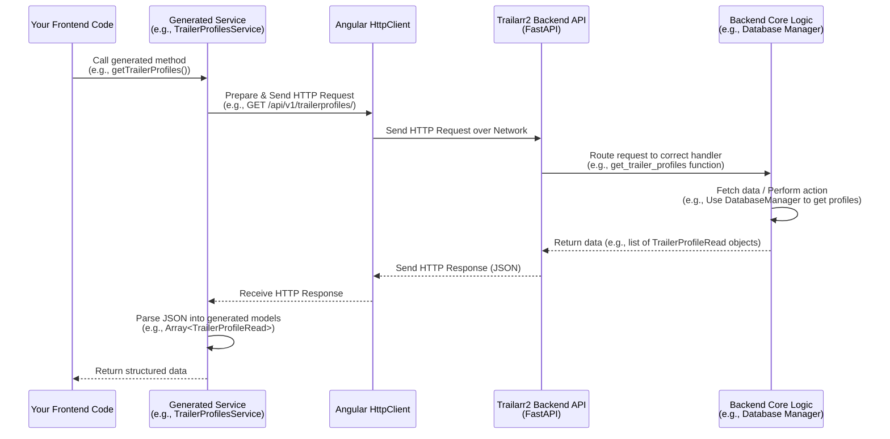

# Chapter 9: Frontend API Services (Generated)

Welcome back to the Trailarr2 tutorial!

In our journey so far, we've explored many parts of the Trailarr2 backend: how it stores data using [Database Models](01_database_models_.md), manages settings with [Application Settings](02_application_settings_.md), starts up with the [Main Application Entry](03_main_application_entry_.md), interacts with its database using [Database Managers](04_database_managers_.md), handles files on disk with the [File System Handler](05_file_system_handler_.md), communicates with Radarr/Sonarr via [Arr Connection Managers](06_arr_connection_managers_.md), performs the core trailer download logic with the [Trailer Download Core](07_trailer_download_core_.md), and automates tasks using [Task Scheduling](08_task_scheduling_.md).

All these components work together in the background, but you interact with Trailarr2 through its user interface (the frontend). The frontend needs to be able to:

*   **Ask** the backend for information (like a list of your connections, media items, or task statuses).
*   **Tell** the backend to perform an action (like adding a new connection, starting a download, or changing a setting).

How does the frontend, which runs in your web browser, communicate with the backend, which runs as a separate application? They talk to each other using an **API (Application Programming Interface)**.

## What are Frontend API Services (Generated)? The Automated Translators

Imagine the Trailarr2 backend is a helpful expert who knows everything about your trailers, connections, and settings, but only speaks Python. The frontend is a busy assistant who needs this information and can trigger actions, but only speaks JavaScript (or TypeScript, as used in Trailarr2's frontend).

They need a **translator**. This is what the API provides – a defined set of questions the assistant can ask and commands they can give, along with instructions on how the expert will respond.

Manually writing the code for the assistant to ask every question and give every command perfectly can be tedious and prone to errors. You have to get the URL exactly right, include the right information in the request, send it using the correct method (GET, POST, PUT, DELETE), and know how to understand the response data format.

**Frontend API Services (Generated)** are like **automated translators** or **pre-written script books** for the frontend assistant. Because the backend (using FastAPI) can automatically describe its API in a standardized format (called OpenAPI or Swagger), a special tool can read this description and *automatically write* all the necessary frontend code to talk to that API.

These "Generated Services" handle:
1.  Knowing the correct URL and method for each backend function (like getting all connections).
2.  Packaging any data needed for the request.
3.  Sending the request to the backend.
4.  Receiving the response from the backend.
5.  Automatically converting the response data (which is usually in JSON format) into structured JavaScript/TypeScript objects that the frontend can easily work with.

This saves frontend developers a huge amount of time and ensures the frontend correctly interacts with the backend's API.

## Our Guiding Use Case: Displaying the List of Trailer Profiles

Let's use a concrete example: you want to see the list of [Trailer Profiles](01_database_models_.md) you've configured in Trailarr2 through the web interface.

The frontend needs to:
*   Ask the backend for the list of profiles.
*   Receive the list.
*   Display the names and details of each profile.

This requires the frontend to make an API call to the backend's endpoint that provides trailer profiles. The "Generated Services" make this call easy.

## Using a Generated API Service (The Simple Way)

The generated code in Trailarr2's frontend includes a service specifically for interacting with Trailer Profiles: `TrailerProfilesService`. This service has methods corresponding to the API endpoints for managing profiles.

To get the list of trailer profiles in the frontend code (which is written in Angular using TypeScript), you would typically do something like this:

```typescript
// Imagine this is in an Angular component or service on the frontend

import { TrailerProfilesService } from 'frontend/generated-sources/openapi/services';
import { TrailerProfileRead } from 'frontend/generated-sources/openapi/models';

// ... assume this service is injected into your component/service ...
constructor(private trailerProfilesService: TrailerProfilesService) { }

// --- Inside a method that runs when you need the data ---
loadTrailerProfiles() {
  console.log('Requesting trailer profiles from backend...');
  // Call the generated service method
  this.trailerProfilesService.getTrailerProfilesApiV1TrailerprofilesGet()
    .subscribe({
      next: (profiles: TrailerProfileRead[]) => {
        // 'profiles' is now a structured array of TrailerProfileRead objects!
        console.log(`Received ${profiles.length} trailer profiles.`);
        console.log('First profile name:', profiles[0]?.name);
        // You can now use this 'profiles' array to update your UI
        this.myTrailerProfilesList = profiles;
      },
      error: (error) => {
        console.error('Failed to load trailer profiles:', error);
        // Handle the error, maybe show a message to the user
      }
    });
}

// ... rest of your component/service code ...
```

Let's break this down:

1.  **`import { TrailerProfilesService } from '.../services';`**: We import the specific generated service class responsible for interacting with trailer profiles.
2.  **`import { TrailerProfileRead } from '.../models';`**: We also import the *generated model* that represents a `TrailerProfile` as it's read from the API. This tells our frontend code exactly what properties (`id`, `name`, `file_format`, etc.) a `TrailerProfileRead` object will have and their types.
3.  **`constructor(private trailerProfilesService: TrailerProfilesService) { }`**: In Angular, we "inject" the service into the component or another service. This makes an instance of the `TrailerProfilesService` available for use.
4.  **`this.trailerProfilesService.getTrailerProfilesApiV1TrailerprofilesGet()`**: This is the core step! We call a method on the generated service instance. Notice the method name: `getTrailerProfilesApiV1TrailerprofilesGet`. This name is automatically generated based on the backend API endpoint: `GET /api/v1/trailerprofiles/`. It's very clear what this method does! We don't need to manually write `fetch(...)` or `this.http.get('/api/v1/trailerprofiles/')`.
5.  **`.subscribe({...})`**: API calls are asynchronous (they take time to complete). The `.subscribe` pattern is how Angular handles responses. The `next` function is called when the backend successfully responds with data. The `error` function is called if something goes wrong.
6.  **`(profiles: TrailerProfileRead[]) => { ... }`**: Inside the `next` function, the `profiles` variable is automatically of the correct type: an array (`[]`) of `TrailerProfileRead` objects. The generated service code has already handled parsing the raw JSON response into these structured objects based on the generated models.

Using the generated service is simple: import the right service and model, call the method that corresponds to the API operation you need, and handle the success and error responses.

## How Frontend API Services Work Under the Hood (The Automation Process)

Let's lift the hood and see what happens, starting from the backend's API definition:

1.  **Backend Defines API Endpoints:** In the backend code, specifically in files like `backend/api/v1/routes/trailerprofiles.py`, FastAPI "decorates" Python functions to define API endpoints. For example:

    ```python
    # From: backend/api/v1/routes/trailerprofiles.py (Simplified)
    from fastapi import APIRouter, Depends
    from core.base.database.models.trailerprofile import TrailerProfileRead, TrailerProfileCreate # Models!
    from core.base.database.manager.trailerprofile import TrailerProfileManager # Database Manager!
    from sqlmodel import Session # Database session

    router = APIRouter(tags=["Trailer Profiles"]) # Group these routes

    @router.get(
        "/",
        response_model=list[TrailerProfileRead], # Defines the expected output structure!
        summary="Get all trailer profiles",
        description="Get all trailer profiles",
    )
    def get_trailer_profiles(
        session: Session = Depends(get_db_session), # Dependency injection to get DB session
        # ... other dependencies ...
    ) -> list[TrailerProfileRead]:
        """Get all trailer profiles."""
        # Use the Database Manager to get the data
        profiles = TrailerProfileManager().read_all(session=session)
        return profiles # Returns a list of TrailerProfileRead objects
    ```
    This snippet shows a backend function decorated with `@router.get("/")`. This tells FastAPI: "When a `GET` request comes to the `/api/v1/trailerprofiles/` path (because of how this router is included in `main.py`), run this function." The `response_model=list[TrailerProfileRead]` is crucial – it tells FastAPI (and thus the OpenAPI spec generator) exactly the structure of the data this endpoint will return. The function uses a [Database Manager](04_database_managers_.md) to fetch the data.

2.  **FastAPI Generates OpenAPI Spec:** Based on these decorated functions, FastAPI automatically generates a `openapi.json` file. This file is a machine-readable description of the *entire* backend API, listing every endpoint, its path, method, expected input parameters, and the structure of the expected response data using definitions derived from the [Database Models](01_database_models_.md). This is the "instruction manual" the automated tool will read.

3.  **Frontend Tool Reads Spec and Generates Code:** When the Trailarr2 project is built, a tool (like `ng-openapi-gen`) is run. It reads the `openapi.json` file and generates all the code found in the `frontend/generated-sources/openapi/` directory. This includes:
    *   `services.ts`: An index file listing all the generated service classes (e.g., `ConnectionsService`, `MediaService`, `TasksService`, `TrailerProfilesService`).
    *   Individual service files (e.g., `services/trailer-profiles.service.ts`): Classes with methods like `getTrailerProfilesApiV1TrailerprofilesGet` corresponding to each API endpoint defined in the spec.
    *   Model files (`models/*.ts`): TypeScript interfaces/classes (`ConnectionRead`, `MediaRead`, `TrailerProfileRead`, `TaskInfo`, etc.) that mirror the structure of the [Database Models](01_database_models_.md) and other data structures used by the API.
    *   Helper functions (`fn/**/*.ts`): Lower-level code that the services use to actually construct and send the HTTP requests using Angular's `HttpClient`.

4.  **Frontend Code Calls Generated Service:** When the frontend application code (like our example above) calls `this.trailerProfilesService.getTrailerProfilesApiV1TrailerprofilesGet()`, it's executing code that was *automatically written* by the generation tool.

5.  **Generated Service Uses HTTP Client:** Inside the generated `getTrailerProfilesApiV1TrailerprofilesGet` method, the code uses the standard Angular `HttpClient` to make the actual `GET` request to the backend's `/api/v1/trailerprofiles/` endpoint.

6.  **Backend Processes Request & Responds:** The backend receives the request, runs the corresponding Python function (`get_trailer_profiles`), fetches data using the [Database Manager](04_database_managers_.md), and returns the list of `TrailerProfileRead` objects. FastAPI automatically converts this Python list of SQLModel objects into a JSON response formatted according to the `TrailerProfileRead` schema defined in the OpenAPI spec.

7.  **Generated Service Parses Response:** The generated service code receives the raw JSON response from the backend. Because it knows (from the OpenAPI spec) that the expected response structure matches the generated `TrailerProfileRead` model, it automatically parses the JSON and provides the data as an array of `TrailerProfileRead` objects.

8.  **Frontend Receives Structured Data:** The `subscribe` block in the frontend application code receives this nicely structured array of `TrailerProfileRead` objects, ready to be used to update the user interface ([Frontend UI Components](10_frontend_ui_components_.md)).

This entire pipeline, from backend API definition to readily usable frontend objects, is automated by the generation process, making backend-frontend communication much smoother.

Here's a simplified sequence diagram showing this flow:



## Peeking Inside the Generated Code

Let's look at the provided code snippets from the `frontend/generated-sources/openapi/` directory. Remember, you *don't* write this code manually; it's generated by the tool.

First, the index file listing all services:

```typescript
// File: frontend/generated-sources/openapi/services.ts

/* tslint:disable */
/* eslint-disable */
/* Code generated by ng-openapi-gen DO NOT EDIT. */

export {ConnectionsService} from './services/connections.service';
export {CustomFiltersService} from './services/custom-filters.service';
export {FilesService} from './services/files.service';
export {HealthCheckService} from './services/health-check.service';
export {LogsService} from './services/logs.service';
export {MediaService} from './services/media.service';
export {SearchService} from './services/search.service';
export {SettingsService} from './services/settings.service';
export {TasksService} from './services/tasks.service'; // Service for tasks
export {TrailerProfilesService} from './services/trailer-profiles.service'; // Service for trailer profiles

```
This `services.ts` file simply re-exports all the individual generated services, making it easy to import them into your frontend code from a single location (e.g., `import { TrailerProfilesService, TasksService } from 'frontend/generated-sources/openapi/services';`).

Next, let's look at the generated service for Trailer Profiles:

```typescript
// File: frontend/generated-sources/openapi/services/trailer-profiles.service.ts (Simplified)

/* tslint:disable */
/* eslint-disable */
/* Code generated by ng-openapi-gen DO NOT EDIT. */

import {HttpClient, HttpContext} from '@angular/common/http';
import {Injectable} from '@angular/core';
import {Observable} from 'rxjs';
import {map} from 'rxjs/operators';

import {ApiConfiguration} from '../api-configuration'; // Holds the base URL
import {BaseService} from '../base-service'; // Provides common HTTP methods
import {StrictHttpResponse} from '../strict-http-response';

// Import generated functions for specific API calls
import { getTrailerProfilesApiV1TrailerprofilesGet, GetTrailerProfilesApiV1TrailerprofilesGet$Params, } from '../fn/trailer-profiles/get-trailer-profiles-api-v-1-trailerprofiles-get';
import { createTrailerProfileApiV1TrailerprofilesPost, CreateTrailerProfileApiV1TrailerprofilesPost$Params, } from '../fn/trailer-profiles/create-trailer-profile-api-v-1-trailerprofiles-post';
// ... other imports for update, delete methods ...

import {TrailerProfileRead} from '../models/trailer-profile-read'; // Import the generated model

@Injectable({providedIn: 'root'})
export class TrailerProfilesService extends BaseService {
  constructor(config: ApiConfiguration, http: HttpClient) {
    super(config, http); // Inherit from BaseService which uses HttpClient
  }

  /** Path part for operation `getTrailerProfilesApiV1TrailerprofilesGet()` */
  static readonly GetTrailerProfilesApiV1TrailerprofilesGetPath = '/api/v1/trailerprofiles/';

  /**
   * Get all trailer profiles.
   *
   * Get all trailer profiles
   *
   * This method provides access to the full `HttpResponse`, allowing access to response headers.
   * To access only the response body, use `getTrailerProfilesApiV1TrailerprofilesGet()` instead.
   *
   * This method doesn't expect any request body.
   */
  getTrailerProfilesApiV1TrailerprofilesGet$Response(
    params?: GetTrailerProfilesApiV1TrailerprofilesGet$Params,
    context?: HttpContext,
  ): Observable<StrictHttpResponse<Array<TrailerProfileRead>>> {
    // Calls the generated helper function to perform the actual HTTP request
    return getTrailerProfilesApiV1TrailerprofilesGet(this.http, this.rootUrl, params, context);
  }

  /**
   * Get all trailer profiles.
   *
   * Get all trailer profiles
   *
   * This method provides access only to the response body.
   * To access the full response (for headers, for example), `getTrailerProfilesApiV1TrailerprofilesGet$Response()` instead.
   *
   * This method doesn't expect any request body.
   */
  getTrailerProfilesApiV1TrailerprofilesGet(
    params?: GetTrailerProfilesApiV1TrailerprofilesGet$Params,
    context?: HttpContext,
  ): Observable<Array<TrailerProfileRead>> {
    // This is the simpler method most frontend code will use
    // It calls the $Response method and just extracts the response body
    return this.getTrailerProfilesApiV1TrailerprofilesGet$Response(params, context).pipe(
      map((r: StrictHttpResponse<Array<TrailerProfileRead>>): Array<TrailerProfileRead> => r.body),
    );
  }

  /** Path part for operation `createTrailerProfileApiV1TrailerprofilesPost()` */
  static readonly CreateTrailerProfileApiV1TrailerprofilesPostPath = '/api/v1/trailerprofiles/';

  /**
   * Create a new trailer profile.
   *
   * Create a new trailer profile
   *
   * This method provides access to the full `HttpResponse`, allowing access to response headers.
   * ... docs ...
   * This method sends `application/json` and handles request body of type `application/json`.
   */
  createTrailerProfileApiV1TrailerprofilesPost$Response(
    params: CreateTrailerProfileApiV1TrailerprofilesPost$Params,
    context?: HttpContext,
  ): Observable<StrictHttpResponse<TrailerProfileRead>> {
     // Calls the generated helper function with POST method and request body
    return createTrailerProfileApiV1TrailerprofilesPost(this.http, this.rootUrl, params, context);
  }

  // ... simpler create method and other methods (get by ID, update, delete, etc.) ...
}
```
This snippet shows the `TrailerProfilesService` class. It's marked with `@Injectable` so Angular can provide it. It has methods like `getTrailerProfilesApiV1TrailerprofilesGet` and `createTrailerProfileApiV1TrailerprofilesPost`. Notice:
*   Method names like `getTrailerProfilesApiV1TrailerprofilesGet` directly reflect the backend API endpoint (`GET /api/v1/trailerprofiles/`).
*   The docstrings and descriptions are pulled directly from the backend code's documentation (like the summary and description in the `@router.get` decorator).
*   The return types are specific generated models (`Observable<Array<TrailerProfileRead>>` or `Observable<TrailerProfileRead>`). This tells the frontend exactly what kind of data to expect back.
*   These methods internally call helper functions (like `getTrailerProfilesApiV1TrailerprofilesGet`) which contain the low-level HTTP request logic. This keeps the service class clean.

The other generated service files (`connections.service.ts`, `media.service.ts`, `tasks.service.ts`, `files.service.ts`, etc.) follow the same pattern, providing easy-to-use methods for all the backend API endpoints related to their specific area. For example:

```typescript
// File: frontend/generated-sources/openapi/services/tasks.service.ts (Simplified)

// ... imports ...
import { getScheduledTasksApiV1TasksSchedulesGet } from '../fn/tasks/get-scheduled-tasks-api-v-1-tasks-schedules-get';
import { getTaskQueueApiV1TasksQueueGet } from '../fn/tasks/get-task-queue-api-v-1-tasks-queue-get';
import { runTaskNowApiV1TasksRunTaskIdGet } from '../fn/tasks/run-task-now-api-v-1-tasks-run-task-id-get';

import { QueueInfo } from '../models/queue-info'; // Generated model for queue items
import { TaskInfo } from '../models/task-info'; // Generated model for scheduled tasks

@Injectable({providedIn: 'root'})
export class TasksService extends BaseService {
  // ... constructor ...

  getScheduledTasksApiV1TasksSchedulesGet(...): Observable<Array<TaskInfo>> {
    // Calls generated helper for GET /api/v1/tasks/schedules
    // Returns array of generated TaskInfo models
  }

  getTaskQueueApiV1TasksQueueGet(...): Observable<Array<QueueInfo>> {
    // Calls generated helper for GET /api/v1/tasks/queue
    // Returns array of generated QueueInfo models
  }

  runTaskNowApiV1TasksRunTaskIdGet(params: { task_id: string; }): Observable<string> {
    // Calls generated helper for GET /api/v1/tasks/run/{task_id}
    // Expects a parameter 'task_id' and returns a simple string message
  }

  // ... other task-related methods ...
}

// File: frontend/generated-sources/openapi/services/media.service.ts (Simplified)

// ... imports ...
import { getAllMediaApiV1MediaAllGet } from '../fn/media/get-all-media-api-v-1-media-all-get';
import { downloadMediaTrailerApiV1MediaMediaIdDownloadPost } from '../fn/media/download-media-trailer-api-v-1-media-media-id-download-post';
// ... other imports ...

import { MediaRead } from '../models/media-read'; // Generated model for media items
import { FolderInfo } from '../models/folder-info'; // Generated model for folder/file info

@Injectable({providedIn: 'root'})
export class MediaService extends BaseService {
    // ... constructor ...

    getAllMediaApiV1MediaAllGet(...): Observable<Array<MediaRead>> {
         // Calls generated helper for GET /api/v1/media/all
         // Returns array of generated MediaRead models
    }

    getMediaFilesApiV1MediaMediaIdFilesGet(params: { media_id: number; }): Observable<FolderInfo | string> {
        // Calls generated helper for GET /api/v1/media/{media_id}/files
        // Returns generated FolderInfo model or a string message
    }

    downloadMediaTrailerApiV1MediaMediaIdDownloadPost(params: { media_id: number; profile_id: number; yt_id?: string; }): Observable<string> {
        // Calls generated helper for POST /api/v1/media/{media_id}/download
        // Expects parameters media_id, profile_id, yt_id and returns a string message
    }

    // ... many other media-related methods ...
}

```
These examples show the consistent pattern: a generated service class provides methods that map directly to backend endpoints, expect specific input parameters (defined in generated `$Params` interfaces), and return `Observable`s that resolve to generated model objects (or simple types like `string` or `boolean`) representing the backend's response data. This makes frontend development much more efficient as developers can rely on these pre-built, correctly typed communication tools.

## The Role of Generated Models

We briefly mentioned generated models like `TrailerProfileRead`. These are TypeScript interfaces or classes created by the generation tool based on the Pydantic/SQLModel models defined in the backend's [Database Models](01_database_models_.md) and used in the API responses.

```typescript
// File: frontend/generated-sources/openapi/models/trailer-profile-read.ts (Simplified)

/* tslint:disable */
/* eslint-disable */
/* Code generated by ng-openapi-gen DO NOT EDIT. */

// Import generated Filter models if needed
// import { FilterRead } from './filter-read';

/**
 * Represents a trailer profile read model.
 */
export interface TrailerProfileRead {
  audio_codec?: string;
  audio_volume_level?: number;
  codec?: string;
  created_at?: string;
  embed_metadata?: boolean;
  file_format: string;
  file_name: string;
  filters: Array<any>; // Simplified, would link to FilterRead[]
  folder_enabled: boolean;
  folder_name?: string;
  id: number;
  is_default?: boolean;
  is_disabled?: boolean;
  is_locked?: boolean;
  max_duration?: number;
  min_duration?: number;
  name: string;
  remove_silence?: boolean;
  subtitles_enabled?: boolean;
  subtitles_format?: string;
  subtitles_language?: string;
  updated_at?: string;
  video_resolution: number;
}
```
This generated `TrailerProfileRead` interface provides type safety in the frontend. When you get an object of this type from the generated service, your frontend code knows exactly what properties are available (`id`, `name`, `file_format`, `video_resolution`, etc.) and their expected data types. This catches many potential errors during development rather than at runtime.

## Summary and What's Next

In this chapter, we learned about **Frontend API Services (Generated)**. We saw that they act as automated, reliable translators between the Trailarr2 frontend and backend. By reading the backend's OpenAPI specification (generated by FastAPI), a tool automatically creates frontend code – including service classes with methods corresponding to API endpoints and models mirroring backend data structures ([Database Models](01_database_models_.md)). This significantly simplifies frontend development by providing pre-built, type-safe tools for communication, making it easy for the frontend to ask the backend for information or trigger actions using components like [Arr Connection Managers](06_arr_connection_managers_.md) or the [Trailer Download Core](07_trailer_download_core_.md), or interact with [Task Scheduling](08_task_scheduling_.md).

Now that we know how the frontend talks to the backend, we're ready to look at how the actual user interface elements are built using the data and capabilities exposed by these services.

Ready to see how the visual parts of Trailarr2 are assembled? Let's move on!

[Chapter 10: Frontend UI Components](10_frontend_ui_components_.md)

---

Generated by [AI Codebase Knowledge Builder](https://github.com/The-Pocket/Tutorial-Codebase-Knowledge)