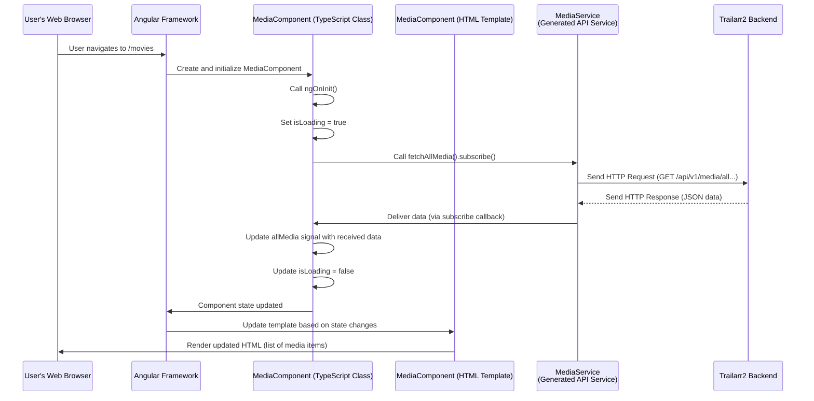

# Chapter 10: Frontend UI Components

Welcome back to the Trailarr2 tutorial!

In our previous chapter, [Chapter 9: Frontend API Services (Generated)](09_frontend_api_services__generated__.md), we learned how the Trailarr2 backend uses FastAPI to expose its capabilities through a structured API, and how tools can automatically generate frontend code (the "Generated Services") that knows exactly how to talk to this API. This gives our frontend (the part you see in your browser) the ability to ask the backend for information (like your list of movies) and tell it to do things (like download a trailer).

But just knowing *how* to talk to the backend isn't enough to create a user interface. You still need the actual buttons, lists, tables, and forms that you click and type into. You need a way to take the data received from the backend and display it nicely. You need to organize all these visual pieces that make up the web page.

This is where **Frontend UI Components** come in.

## What are Frontend UI Components? The Building Blocks

Imagine you're building something visual, like a complex dashboard or an interactive report. You don't just pour all the data and logic into one giant messy blob. You break it down into smaller, manageable pieces.

**Frontend UI Components** are like the **building blocks** or **Lego bricks** of the application's user interface. Each component is a self-contained piece responsible for a specific part of the screen and its related behavior.

Think of a web page as a collection of components:
*   A "Navigation Bar" component at the top.
*   A "Sidebar" component on the side.
*   A "List of Movies" component in the main area.
*   A "Search Bar" component above the list.
*   A "Movie Details" component that shows information about a single movie.
*   A "Settings Form" component for changing preferences.

Each component combines three things:
1.  **Structure (HTML):** Defines the elements on the page (buttons, text, tables, images).
2.  **Appearance (CSS/SCSS):** Controls how the elements look (colors, fonts, layout, spacing).
3.  **Behavior & Data (TypeScript/JavaScript):** Manages data, responds to user actions (like clicks or typing), and uses the [Frontend API Services (Generated)](09_frontend_api_services__generated__.md) to communicate with the backend.

These components are designed to be reusable. A "Button" component might be used in many different places, but even complex components like "List of Media" can be reused on different pages (e.g., a list for movies and a list for series might use the same underlying "Media Item Row" component).

## Our Guiding Use Case: Displaying the List of Media Items

Let's revisit a common task: displaying the list of movies or series that Trailarr2 knows about. This list appears on the "Media" pages (like `/movies` or `/series`).

To do this, the frontend needs a component (or a set of components) that can:
1.  Know which type of media (movies or series) to display based on the page URL.
2.  Fetch the list of media items from the backend using the appropriate [Generated API Service](09_frontend_api_services__generated__.md).
3.  Store this list of media data.
4.  Generate the necessary HTML structure (like a table or a list) to display each media item.
5.  Format the data for display (e.g., show the title and year, display status icons).
6.  Handle user interactions on the list (like clicking on a media item to see details, selecting items for batch operations).

The `MediaComponent` (found in `frontend/src/app/media/media.component.ts`) is the primary component responsible for this task in Trailarr2.

## Using UI Components (Interacting with the Visuals)

As a user, you don't "use" components in the code sense; you interact with them visually in your browser. You click buttons rendered by a "Button" component, read text displayed by a "Text" component, and see lists presented by a "List" component.

From the perspective of building the UI, you assemble components together to create pages. For example, a "Media Page" might contain:

```html
<!-- Simplified example of how components are used in an HTML template -->
<app-topnav></app-topnav> <!-- The Top Navigation component -->
<app-sidenav></app-sidenav> <!-- The Side Navigation component -->

<main class="main-content">
  <h1>My Media Library</h1>
  <!-- The Media Component is placed here to display the list -->
  <app-media2></app-media2>
</main>

<app-footer></app-footer> <!-- A Footer component -->
```

In this example, `<app-media2>` is the "tag" that tells the web browser (and the Angular framework Trailarr2 uses) to load and display the `MediaComponent` in that spot on the page.

When the `MediaComponent` loads, its internal logic runs. This logic uses the generated `MediaService` ([Frontend API Services (Generated)](09_frontend_api_services__generated__.md)) to fetch the list of media from the backend. Once the data arrives, the component's template uses Angular's features (like `*ngFor` loops) to create an HTML row or card for each item in the list, displaying the movie's title, year, status, etc.

## How UI Components Work Under the Hood (Combining Structure, Style, and Logic)

Let's look at the core pieces that make up an Angular UI component, using our `MediaComponent` as an example:

1.  **Component Definition (`@Component` decorator):** This special marker tells Angular that a standard TypeScript class is a component. It links the class to its template and styles.

    ```typescript
    // From: frontend/src/app/media/media.component.ts (Simplified)
    import { Component, computed, inject, OnInit, signal } from '@angular/core';
    // ... other imports ...
    import { MediaService } from '../services/media.service'; // Import the generated service

    @Component({
      selector: 'app-media2', // The HTML tag name for this component
      imports: [
        // List of other components/modules this template uses
        // ... FormsModule, NgTemplateOutlet, RouterLink, etc. ...
      ],
      templateUrl: './media.component.html', // Path to the HTML template file
      styleUrl: './media.component.scss', // Path to the SCSS/CSS style file
    })
    export class MediaComponent implements OnInit {
        // Properties and methods for the component's logic and data
        private readonly mediaService = inject(MediaService); // Inject the service
        // ... other injected services ...

        // Data properties (often using Angular Signals now)
        isLoading = signal<boolean>(true);
        allMedia = signal<Media[]>([]); // Array to hold media items
        filteredSortedMedia = computed(() => this.computeFilteredNSortedMedia()); // Derived data
        displayMedia = computed(() => { /* ... slicing logic ... */ }); // Data currently visible

        // Configuration properties
        moviesOnly = signal<boolean | null>(null);
        selectedSort = signal<keyof Media>('added_at');
        // ... filters, pagination settings ...

        // Lifecycle method - runs when the component is initialized
        ngOnInit() {
            this.isLoading.set(true);
            // ... logic to determine movies/series only based on route ...
            this.fetchMediaData(); // Call a method to load data
        }

        // Method to fetch data using the service
        fetchMediaData() {
            // Call the generated service's method
            this.mediaService.fetchAllMedia(this.moviesOnly()).subscribe((mediaList) => {
                // Process the received data and update the component's state
                this.allMedia.set(mediaList.map((media) => mapMedia(media))); // Store data
                this.isLoading.set(false); // Update loading state
            });
        }

        // Method to handle user actions (e.g., sorting)
        setMediaSort(sortBy: keyof Media): void {
            this.selectedMedia = [];
            // ... update sorting signals ...
            // The 'computed' property filteredSortedMedia automatically updates
            // The 'displayMedia' computed property also updates
            // Angular automatically updates the template
        }

        // ... other methods for filtering, selection, batch updates, etc. ...

        // Logic to filter and sort (used by the computed property)
        computeFilteredNSortedMedia(): Media[] { /* ... filtering and sorting logic ... */ }

        // ... other helper methods ...
    }
    ```
    This snippet shows the basic structure. The `@Component` decorator links the TypeScript class to its visual representation. Inside the class, `inject` is used to get access to necessary services (like `MediaService`). Properties (like `allMedia`, `isLoading`, `selectedSort`) hold the component's state and data. `ngOnInit` is a "lifecycle hook" that runs automatically when the component is ready; this is where initial data loading often happens. Methods like `fetchMediaData` encapsulate specific actions, using the injected services.

2.  **HTML Template (`media.component.html`):** This file contains the standard HTML tags that define the component's structure. It also includes special Angular syntax for displaying data and responding to events.

    ```html
    <!-- From: frontend/src/app/media/media.component.html (Simplified) -->

    <!-- Loading indicator component -->
    <app-load-indicator *ngIf="isLoading()"></app-load-indicator>

    <!-- Controls for sorting and filtering -->
    <div class="media-controls">
      <select [(ngModel)]="selectedFilter" (change)="setMediaFilter(selectedFilter())">
        <!-- Loop through filter options defined in the TS class -->
        <option *ngFor="let filter of allFilters()" [value]="filter">{{ filter }}</option>
      </select>

      <select [(ngModel)]="selectedSort" (change)="setMediaSort(selectedSort())">
         <!-- Loop through sort options defined in the TS class -->
        <option *ngFor="let sort of sortOptions" [value]="sort">{{ sort | titlecase }}</option>
      </select>
      <button (click)="sortAscending.set(!sortAscending())">
         Sort {{ sortAscending() ? 'Ascending' : 'Descending' }}
      </button>

      <!-- Edit mode toggle -->
      <button (click)="toggleEditMode(!inEditMode)">
        {{ inEditMode ? 'Done' : 'Edit' }}
      </button>

      <!-- Batch update buttons (only visible in edit mode if items are selected) -->
      <ng-container *ngIf="inEditMode && selectedMedia.length > 0">
        <button (click)="batchUpdate('monitor')">Monitor Selected</button>
        <!-- ... other batch action buttons ... -->
      </ng-container>
    </div>

    <!-- The main list/table for media items -->
    <div class="media-list" scrollNearEnd (nearEnd)="onNearEndScroll()">
       <!-- Loop through the media items to display (using the computed signal) -->
      <div class="media-item" *ngFor="let mediaItem of displayMedia()">
        <!-- Checkbox for selection (only in edit mode) -->
        <input
          type="checkbox"
          *ngIf="inEditMode"
          [checked]="selectedMedia.includes(mediaItem.id)"
          (change)="onMediaSelected(mediaItem, $event)"
        />
        <!-- Link to the details page -->
        <a [routerLink]="['/media', mediaItem.id]">
            <!-- Display data from the mediaItem object -->
            <h3>{{ mediaItem | displayTitle }} ({{ mediaItem.year }})</h3>
            <p>Status: {{ mediaItem.status }}</p>
            <!-- ... other details ... -->
        </a>
      </div>
    </div>
    ```
    This simplified HTML shows:
    *   `*ngIf="isLoading()"`: An Angular directive that shows or hides the loading indicator based on the `isLoading` signal in the TS class.
    *   `[(ngModel)]="selectedFilter"`: Two-way data binding. The value of the `<select>` element is kept in sync with the `selectedFilter` signal.
    *   `(change)="setMediaFilter(...)":` Event binding. When the value of the `<select>` changes, the `setMediaFilter` method in the TS class is called.
    *   `*ngFor="let filter of allFilters()"`: Loops through the `allFilters` computed signal and creates an `<option>` tag for each filter.
    *   `(click)="toggleEditMode(...)`: Event binding. When the button is clicked, the `toggleEditMode` method is called.
    *   `*ngIf="inEditMode && selectedMedia.length > 0"`: Shows the batch buttons only when `inEditMode` is true and items are selected.
    *   `*ngFor="let mediaItem of displayMedia()"`: This is the core loop that iterates over the `displayMedia` computed signal and creates a `<div>` for each media item currently visible.
    *   `[checked]="selectedMedia.includes(mediaItem.id)"`: Property binding. The checkbox's `checked` property is set based on whether the `mediaItem.id` is in the `selectedMedia` array.
    *   `(change)="onMediaSelected(...)`: Event binding on the checkbox.
    *   `[routerLink]="['/media', mediaItem.id]"`: Creates a link that navigates to the details page for this specific media item using its ID.
    *   `{{ mediaItem | displayTitle }}`: Interpolation. Displays the value of the `mediaItem` after passing it through the `displayTitle` pipe (a way to transform data for display).

3.  **Styles (SCSS/CSS file):** The `media.component.scss` file contains the styles that determine the layout, colors, fonts, etc., for *only* the elements within this component's template. This keeps styles organized and prevents them from affecting other parts of the application unintentionally.

Putting it together: the `MediaComponent`'s TypeScript class fetches data using a [Generated API Service](09_frontend_api_services__generated__.md), stores it in signals/properties, and defines logic for interactions. The HTML template uses Angular syntax to display this data and call methods in the class when users interact with the elements. The SCSS file makes it look good.

Here's a simplified flow of the `MediaComponent` loading and displaying data:



This flow shows how the component class initiates the data fetching, updates its internal state, and the Angular framework automatically re-renders the template to reflect these changes.

## Other Examples of UI Components

The code snippets provided show other examples of UI components in Trailarr2:

*   **`AppComponent` (`app.component.ts`):** This is the root component that acts as the main shell for the entire application. It contains the top navigation (`<app-topnav>`), side navigation (`<app-sidenav>`), and a `router-outlet` where other page components (like `MediaComponent`, `SettingsComponent`) are loaded based on the URL. It also handles global logic like idle detection and displaying toast messages received from the [WebsocketService](frontend/src/app/services/websocket.service.ts).
*   **`SettingsComponent` (`settings.component.ts`):** A simple container component for the settings pages. It defines navigation links (`RouterLink`) to different settings sections (Connections, Profiles, etc.) and uses a `RouterOutlet` to display the specific settings component for the current sub-page (not shown in snippets, but implied by the structure).
*   **`MediaDetailsComponent` (`media-details.component.ts`):** Responsible for displaying information about a *single* media item. It reads the media item's ID from the URL using Angular's routing features (`input(0, {transform: Number})`), fetches the specific media item's data using `mediaService.getMediaByID()`, displays details in its template, and provides methods for actions like downloading (`downloadTrailer`), monitoring (`monitorSeries`), searching (`searchTrailer`), or deleting the trailer (`onConfirmDelete`), all of which call methods on the `MediaService` ([Generated API Service](09_frontend_api_services__generated__.md)). It also uses `@ViewChild` to interact with dialog elements for things like confirming deletions.
*   **`LogsComponent` (`logs.component.ts`):** Fetches and displays application logs using `logsService.getLogs()`. It includes basic frontend search logic to filter the displayed logs without refetching everything from the backend.
*   **`TasksComponent` (`tasks.component.ts`):** Fetches and displays the list of scheduled tasks and currently running/queued tasks using `tasksService.getScheduledTasks()` and `tasksService.getQueuedTasks()`. It demonstrates using the `WebsocketService` to automatically refresh the displayed task list when background task events occur in the backend ([Task Scheduling](08_task_scheduling_.md)). It also provides a button to manually trigger a task (`runTask` calls `tasksService.runScheduledTask`).

These examples show how different components are built for specific purposes, how they inject and use [Generated API Services](09_frontend_api_services__generated__.md) to interact with the backend, manage their own data and state, and combine HTML, CSS, and TypeScript logic to create interactive visual elements.

## Role of Generated API Services

It's clear from the examples that UI Components depend heavily on [Frontend API Services (Generated)](09_frontend_api_services__generated__.md). The components don't know *how* to make an HTTP request or *how* to parse JSON; they just know they need data or need to trigger an action. They rely on the generated services to be their reliable communication layer with the backend.

The generated models (like `MediaRead`, `TaskInfo`, `QueueInfo`) are also crucial here. When a component receives data from a generated service, the data already matches a defined structure (the generated model). This allows the component's TypeScript code to safely access properties like `mediaItem.title` or `task.name` without guessing or worrying about typos, thanks to TypeScript's type checking.

## Summary

In this chapter, we explored **Frontend UI Components**, the building blocks of the visual user interface in Trailarr2. We learned that each component is a self-contained unit combining HTML structure, CSS/SCSS styles, and TypeScript logic. We saw how components like the `MediaComponent` use [Frontend API Services (Generated)](09_frontend_api_services__generated__.md) to fetch data from the backend ([Database Managers](04_database_managers_.md) via the API), display it in their templates, and handle user interactions that might trigger actions on the backend (like downloads using the [Trailer Download Core](07_trailer_download_core_.md) or task execution using [Task Scheduling](08_task_scheduling_.md)).

We've now covered the entire structure of the Trailarr2 project, from the fundamental data blueprints in the database to the visual elements you interact with in your browser.

This concludes our tutorial on the structure of the Trailarr2 project! You now have a foundational understanding of its major components and how they work together.

---

Generated by [AI Codebase Knowledge Builder](https://github.com/The-Pocket/Tutorial-Codebase-Knowledge)