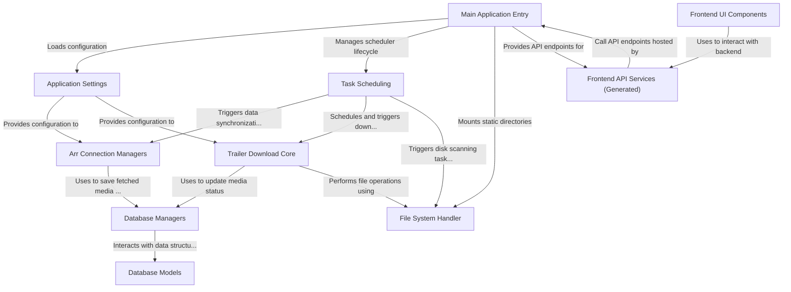

# Tutorial: trailarr2

Trailarr is an application that helps you manage *trailers* for your media library.
It connects to **Radarr** and **Sonarr** to sync your movie and series lists,
automatically finds and **downloads trailers** from sources like YouTube,
and organizes them alongside your media files. It also provides a **web interface**
to view your media, manage connections, configure download settings, and monitor tasks.

**Source Repository:** [None](None)

## Chapters

1. [Database Models
](01_database_models_.md)
2. [Application Settings
](02_application_settings_.md)
3. [Main Application Entry
](03_main_application_entry_.md)
4. [Database Managers
](04_database_managers_.md)
5. [File System Handler
](05_file_system_handler_.md)
6. [Arr Connection Managers
](06_arr_connection_managers_.md)
7. [Trailer Download Core
](07_trailer_download_core_.md)
8. [Task Scheduling
](08_task_scheduling_.md)
9. [Frontend API Services (Generated)
](09_frontend_api_services__generated__.md)
10. [Frontend UI Components
](10_frontend_ui_components_.md)

---

Generated by [AI Codebase Knowledge Builder](https://github.com/The-Pocket/Tutorial-Codebase-Knowledge)